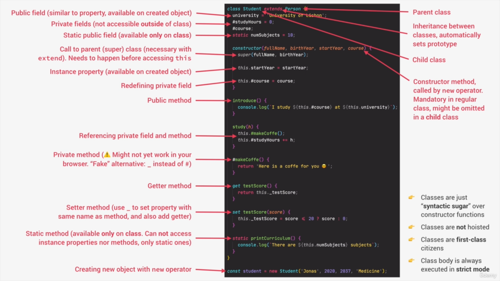

# Notes for Javascript

**[Live Site Link](https://chandraprakash-darji.github.io/js-recap/)**

_(Credits [Jonas Schmedtmann](https://twitter.com/jonasschmedtman) JS Course for amazing content that i learned)_

**Navigate to the Topic**

- [Notes for Javascript](#notes-for-javascript)
  - [Basis of JS](#basis-of-js)
  - [The 7 Primitive Data types](#the-7-primitive-data-types)
  - [Operators in JS](#operators-in-js)
    - [Arithmetic Operators](#arithmetic-operators)
    - [Assignment Operators](#assignment-operators)
    - [Comparison Operators](#comparison-operators)
    - [Logical Operators](#logical-operators)
    - [Ternary Operators](#ternary-operators)
    - [Spread/Rest Operator](#spreadrest-operator)
  - [Template literals (Template strings)](#template-literals-template-strings)
  - [Conditional Statment ( if-Else )](#conditional-statment--if-else-)
  - [Type Conversion and Coercion](#type-conversion-and-coercion)
    - [Type Conversion](#type-conversion)
      - [Falsy values](#falsy-values)
      - [Truely Value](#truely-value)
    - [Type Coercion](#type-coercion)
  - [Switch Statment](#switch-statment)
  - [Functions](#functions)
    - [Default Arguments](#default-arguments)
    - [How passing argument Works :: value vs. Refrence](#how-passing-argument-works--value-vs-refrence)
    - [First Class and Higher Order Function](#first-class-and-higher-order-function)
      - [Some Properties of First-Class Functions](#some-properties-of-first-class-functions)
    - [Higher Order Functions](#higher-order-functions)
      - [Some Properties of Higher-Order Functions](#some-properties-of-higher-order-functions)
        - [Function that recevies another function](#function-that-recevies-another-function)
        - [Function that returns a new function](#function-that-returns-a-new-function)
      - [Implimentation](#implimentation)
        - [Function Accepting CallBacks](#function-accepting-callbacks)
        - [Function Returninng the Function](#function-returninng-the-function)
        - [Call Method](#call-method)
        - [Apply Method](#apply-method)
        - [Bind Method](#bind-method)
    - [Imediately Invoked Functions](#imediately-invoked-functions)
  - [Arrays](#arrays)
  - [Objects](#objects)
  - [Sets](#sets)
  - [Maps](#maps)
  - [Working With String](#working-with-string)
  - [Data Strucutres](#data-strucutres)
    - [List of data Strucures](#list-of-data-strucures)
    - [Sources of Data](#sources-of-data)
    - [Usess of Arrays](#usess-of-arrays)
    - [Usess of Sets](#usess-of-sets)
    - [Usess of Object](#usess-of-object)
    - [Usess of Maps](#usess-of-maps)
    - [Basic Data Structures](#basic-data-structures)
      - [Numbers](#numbers)
      - [BigInt](#bigint)
      - [Date](#date)
      - [Intl NameSpace](#intl-namespace)
  - [Loops](#loops)
    - [For Loops](#for-loops)
    - [For of loops](#for-of-loops)
    - [ForEach loops](#foreach-loops)
    - [Nested Loops](#nested-loops)
    - [While loop](#while-loop)
    - [Loop Control Statments](#loop-control-statments)
      - [Continue](#continue)
      - [Break](#break)
  - [Timers](#timers)
    - [SetTimeout](#settimeout)
    - [setInterval](#setinterval)
  - [DOM Manuplication](#dom-manuplication)
    - [Accessing Dom Elements](#accessing-dom-elements)
    - [Dom traversing](#dom-traversing)
    - [Create New DOM Elements](#create-new-dom-elements)
    - [Add Elements to the DOM](#add-elements-to-the-dom)
    - [Remove Html Element](#remove-html-element)
    - [Add/Remove/Toggle/Check Classes](#addremovetogglecheck-classes)
    - [Updating Styles Using Dom](#updating-styles-using-dom)
    - [Changing the Atributes](#changing-the-atributes)
    - [Events in DOM](#events-in-dom)
  - [Short Circuiting](#short-circuiting)
  - [Nullish Coalescing Operator](#nullish-coalescing-operator)
  - [OOPS](#oops)
    - [Class](#class)
    - [THE 4 FUNDAMENTAL OOP PRINCIPLES](#the-4-fundamental-oop-principles)
      - [Abstraction](#abstraction)
      - [Encapsulation](#encapsulation)
      - [Inheritance](#inheritance)
      - [Polymorphism](#polymorphism)
    - [Prototypal inheritance](#prototypal-inheritance)
    - [3 WAYS OF IMPLEMENTING PROTOTYPAL INHERITANCE IN JAVASCRIPT](#3-ways-of-implementing-prototypal-inheritance-in-javascript)
    - [Constructor Function](#constructor-function)
    - [Prototypes](#prototypes)
      - [THE PROTOTYPE CHAIN](#the-prototype-chain)
    - [ES2015 Classes](#es2015-classes)
    - [Getters and Setters](#getters-and-setters)
    - [Object.create()](#objectcreate)
    - [InHertience between Classes](#inhertience-between-classes)
    - [Encapsulation](#encapsulation-1)
    - [Chaining in Class methods](#chaining-in-class-methods)
    - [Class in one Image](#class-in-one-image)
  - [SYNCHRONOUS CODE](#synchronous-code)
  - [ASYNCHRONOUS CODE](#asynchronous-code)
  - [WHAT ARE AJAX CALLS?](#what-are-ajax-calls)
  - [WHAT IS AN API?](#what-is-an-api)
  - [WHAT HAPPENS WHEN WE ACCESS A WEB SERVER](#what-happens-when-we-access-a-web-server)
  - [WHAT ARE PROMISES?](#what-are-promises)
    - [Fetch API](#fetch-api)
    - [THE PROMISE LIFECYCLE](#the-promise-lifecycle)
    - [Building the Promise](#building-the-promise)
    - [Async Await Function](#async-await-function)
    - [Promise Combinator](#promise-combinator)
  - [AN OVERVIEW OF MODULES](#an-overview-of-modules)
    - [WHY MODULES?](#why-modules)
    - [NATIVE JAVASCRIPT (ES6) MODULES](#native-javascript-es6-modules)
    - [HOW ES6 MODULES ARE IMPORTED](#how-es6-modules-are-imported)
    - [Import and Export Modules](#import-and-export-modules)
  - [Developer Skills](#developer-skills)
    - [HOW TO FAIL 🤦 AT LEARNING HOW TO CODE](#how-to-fail--at-learning-how-to-code)
    - [HOW TO SUCCEED 🎉 AT LEARNING HOW TO CODE](#how-to-succeed--at-learning-how-to-code)
    - [HOW TO FAIL 🤦 AT SOLVING PROBLEMS](#how-to-fail--at-solving-problems)
    - [4 STEPS FRAMEWORK TO SOLVE ANY PROBLEM](#4-steps-framework-to-solve-any-problem)
    - [WHAT IS A SOFTWARE BUG?](#what-is-a-software-bug)
    - [THE DEBUGGING PROCESS](#the-debugging-process)

## Basis of JS

1. On page Script

```html
<script type="text/javascript">
    ...
</script>
```

2. Include external JS file

```html
<script src="filename.js"></script>
```

3. Output

```js
console.log(a); // write to the browser console
document.write(a); // write to the HTML
alert(a); // output in an alert box
confirm('Really?'); // yes/no dialog, returns true/false depending on user click
prompt('Your age?', '0'); // input dialog. Second argument is the initial value
```

4. Comments

```js
/* Multi line
comment */
// One line
```

6. Strict mode

```js
'use strict'; // Use strict mode to write secure code
x = 1; // Throws an error because variable is not declared
```

## The 7 Primitive Data types

- To check the Data type of any Varible / Value

```js
console.log(typeof 'ChandraPrakash');
```

- Way of Declaring Variables

```js
var a; // variable
var a = 1,
    b = 2,
    c = a + b; // one line
const PI = 3.14; // constant
let z = 'zzz'; // block scope local variable

('use strict'); // Use strict mode to write secure code
x = 1; // Throws an error because variable is not declared
// Creates property on global scope. [Not reccomend to wright Variable without Declaring]
```

1. Number: Floating point numbers -> Used for decimal and integers.

```js
let age = 23;
console.log(typeof age);
```

2. String: Sequence of characters -> Used for text.

```js
let firstName = 'ChandraPrakash';
console.log(typeof firstname);
```

3. Boolean: Logical type that can only be true or false -> Used for taking decisiions.

```js
let fullAge = true;
console.log(typeof fullAge);
```

4. Undefined Value by a variables is not yet defind("empty value").

```js
let children;
console.log(typeof children);
```

5. Null: Also means 'empty value'.

```js
let myNull = null;
console.log(typeof myNull);
```

6. Symbol (ES2015): Value that is unquie and cannot be changed _[Not useful for now]_.

7. Biglnt (ES2020): Larger integers than the Number type can hold.

## Operators in JS

- [Arithmetic Operators](#arithmetic-operators)
- [Assignment Operators](#assignment-operators)
- [Comparison Operators](#comparison-operators)
- [Logical Operators](#logical-operators)
- [Ternary Operators](#ternary-operators)

### Arithmetic Operators

```js
console.log(10 + 5); // Addition -> 15
console.log(10 - 5); // Subtraction -> 5
console.log(10 / 2); // Division -> 5
console.log(10 * 4); // Multply -> 40
console.log(7 % 2); // Modulas -> 1
console.log(2 ** 4); // 16
console.log(2++); // Increment -> 3
console.log(2--); // Decrement -> 1
```

- Post and Pre Increment/Decrement

```js
let x = 5;
// x++, it will increase the value of x when the program control goes to the next statement.
// ++x, it will increase the value of x there only

x++; //post-increment, x will be 5 here and 6 in the next line
++x; //pre-increment, x will be 7 here
x--; //post-decrement, x will be 7 here and 6 in the next line
--x; //pre-decrement, x will be 5 here
```

### Assignment Operators

```js
let x = 10 + 5; // Assigns right operand value to the left operand. -> 15
x += 10; // Sum left and right operand and stores in left operand -> 25
x *= 4; // Multiply left and right operand and stores in left operand -> 100
// [ " -= " for Subtraction , " /= " for Division , " %= " for Modulas ]
x++; // 101
x--; // 100
x--; // 99
console.log(x); // 99
```

### Comparison Operators

```js
console.log(40 == 8); // Compares the equality of two operands without considering type.
console.log(40 === 8); // Compares equality of two operands with type.
console.log(40 != 8); // Compares inequality of two operands without considering type.
console.log(40 !== 8); // Compares inequality of two operands with type.
console.log(40 < 8); // Less Than / return true if 40 <> 8
console.log(40 >= 8); // Greater Than equal to / return true if 40 >= 8
console.log(40 <= 8); // Less Than equal to / return true if 40 <>= 8
```

### Logical Operators

```js
let a = 5,
    b = 10;

a != b && a < b; // returns true. // Both Condition should true.
a > b || a == b; // returns false // One Condition should true
a < b || a == b; // returns true
!(a < b); // returns false // Inverse the Solution true <-> false
!(a > b); // returns true
```

### Ternary Operators

The second part (after ? and before :) will be executed if the condition turns out to be true. Suppose, the condition returns false, then the third part (after :) will be executed.

```js
let a = 10,
    b = 5;

var c = a > b ? a : b; // value of c would be 10
var d = a > b ? b : a; // value of d would be 5
```

### Spread/Rest Operator

```js
//  Unpacking Array at Once by spread Operator
const arr = [7, 8, 9];
const badNewArr = [1, 2, arr[0], arr[1], arr[2]]; // [1, 2, 7, 8, 9]

const newArr = [1, 2, ...arr]; // [1, 2, 7, 8, 9]
// spread operator is comma seprated Value -> It can be Used for all iterable ( string , array , map , sets ) But not Objects
// this are completing new array

console.log(newArr); // [1, 2, 7, 8, 9]
console.log(...newArr); // 1 2 7 8 9

// Spread operator on String
const str = 'Jonas';
const letters = [...str, '', 'S.']; // ['J', 'o', 'n', 'a', 's', '', 'S.']

// Spread operator are only Used when multiple Values can enter... like you can't use in tmeplte litral

// SPREAD, beacuse it is on RIGHT side of =   -> value seprated by commas
const arr = [1, 2, ...[3, 4]];
console.log(arr); // [1, 2, 3, 4]

// REST, beacuse on LEFT side of =   -> variable seprated by Comma
const [a, b, ...others] = [1, 2, 3, 4, 5, 6];
console.log(a, b, others); // 1 2 [3, 4, 5, 6]

const [pizza, resto, ...otherFood] = [
    ...restaurant.mainMenu,
    ...restaurant.starterMenu,
];
console.log(pizza, resto, otherFood); // Pizza Pasta ['Risotto', 'Focaccia', 'Bruschetta', 'Garlic Bread', 'Caprese Salad']

// Objects
const { sat, ...weekdays } = restaurant.openingHours;
console.log(sat, weekdays); // {open: 0, close: 24} {thu: {…}, fri: {…}}

// FUNCTIONS
const add = function (...numbers) {
    let sum = 0;
    for (let i = 0; i < numbers.length; i++) sum += numbers[i];
    console.log(sum);
};
add(2, 3);
add(2, 3, 4);
add(2, 3, 4, 5);
add(2, 4, 54, 45);

const x = [2, 5, 1, 51, 54, 54, 5];
add(...x);

// Copy Array
const myArr = [1, 2, 3];
const myCopy = [...myArr]; // All elemt of myArr will be Copied
```

## Template literals (Template strings)

```js
// Untagged, these create strings:
`string text``string text line 1 
 string text line 2` // Multi line String
`string text ${expression} string text`; // access any veriable by ${variable_name}
```

- Without Template Literals

```js
let a = 5,
    b = 10;
console.log('Fifteen is ' + (a + b) + ' and \n not ' + (2 * a + b) + '.');
// "Fifteen is 15 and
// not 20."
```

- With Template Literals

```js
let a = 5,
    b = 10;
console.log(`Fifteen is ${a + b} and
not ${2 * a + b}.`);
// "Fifteen is 15 and
// not 20."
```

## Conditional Statment ( if-Else )

```js
const age = 19;
if (age >= 18) {
    // logical condition
    status = 'Eligible for driving License.'; // executed if condition is true
} else {
    // else block is optional
    const yearsLeft = 18 - age;
    status = `Not eligible for driving License. Wait for ${yearsLeft} years`;
    // executed if condition is false
}
```

## Type Conversion and Coercion

- [Type Conversion](#type-conversion) Changing type of the Data explicitly.
- [Type Coercion](#type-coercion) Javascript changing type of the Data implicitly.

### Type Conversion

```js
const inputYear = '1991';
// number() for String to Number
console.log(Number(inputYear), inputYear); // 1991 '1991'
console.log(Number(inputYear) + 18); // 2009

console.log(Number('ChandraPrakash')); // NaN

// String() for Number to String
console.log(String(23)); // 23
```

#### Falsy values

[ 0 , "" , undefined , null , NaN , false ] are false if they are converted to Boolean

```js
console.log(Boolean(0)); // false
console.log(Boolean('')); // false
console.log(Boolean(NaN)); // false
console.log(Boolean(false)); // false
console.log(Boolean(undefined)); // false
console.log(Boolean(null)); // false
```

#### Truely Value

All values are truely if it is not [ 0 , "" , undefined , null , NaN , false ]

### Type Coercion

```js
// 23 Automatically converted to String while logging the String.
// " + " convert number to String
console.log('I am ' + 23 + ' years old.'); // I am 23 years old.

// " - " , " / " , " * "  and also logical operators
// convert String to Number
console.log('23' - '10' - 3); // 10
console.log('23' > '10'); // true

// Example
let n = '1' + 1; // 11
n = n - 1; // 10
console.log(n);
```

## Switch Statment

```js
switch (
    new Date().getDay() // input is current day
) {
    case 6: // if (day == 6)
        text = 'Saturday';
        break;
    case 0: // if (day == 0)
        text = 'Sunday';
        break;
    default:
        // else...
        text = 'Whatever';
}
```

## Functions

```js
// Function Declaration // Pros we can call Before Declaration
function addNumbers(a, b) {
    return a + b;
}
x = addNumbers(1, 2);
console.log(x); // 3

// Function Expression  // Can't call before Declration
const birthYear = 2002;
const calcAge = function (birthYear) {
    return 2022 - birthYear;
};
console.log(calcAge(birthYear)); // 20

// Arow function
const calcAge2 = birthYear => 2022 - birthYear;

// Arrow functions with more than one Variablea
const yearsUntilRetirment = (birthYear, firstName) => {
    const age = 2022 - birthYear;
    const retirment = 65 - age;
    return `${firstName} retires in ${retirment} years`;
};
console.log(yearsUntilRetirment(2002, 'Chandraprakash'));
```

### Default Arguments

```js
const bookings = [];
const createBooking = function (
    flightNum,
    numPassenger = 1, // default Variables
    price = 199 * numPassenger // Using Expression on alredy defined variable
) {
    const booking = {
        flightNum, // Direct object declaration
        numPassenger,
        price,
    };
    console.log(booking);
    bookings.push(booking);
};
createBooking('LH123'); // Passing only one arrgument
createBooking('LH123', 2, 800);
createBooking('LH123', 2); // Calculating price value depending upon passneger
createBooking('LH123', 5);
createBooking('LH123', undefined, 50); // set any value to undefined to skip that value and make it default
console.log(bookings); // Loging all the booking
```

### How passing argument Works :: value vs. Refrence

```js
const flight = 'LH123';
const jonas = {
    name: 'Jonas Schmendtmann',
    passport: 646513132,
};

const checkIn = function (flightNum, passneger) {
    flightNum = 'LH999';
    passneger.name = 'Mr.' + passneger.name;

    if (passneger.passport === 646513132) {
        // alert('CheckIn');
    } else {
        // alert('Wrong Passport');
    }
};
checkIn(flight, jonas);
console.log(flight, jonas); // LH123 {name: 'Mr.Jonas Schmendtmann', passport: 646513132}

// When we pass any primitive data type the copy of data is passed
// But When we pass Object in Function the Refrence is passed not the copy with that :::
// when we change in the function it change the refrence and Orignal One Becuse  it is Saved in memorry Heap
```

### First Class and Higher Order Function

- First Class Function => JavaScript treats function as first-class Citizen =>
- This means that functions are simply values =>
- Functions are just another Object
- Just a concept that a Programming Language as or not :::

#### Some Properties of First-Class Functions

- **Store Functions in Variables or Properties**

    ```js
    const add = (a, b) => a + b;
    ```

    ```js
    const conuter = {
        value: 23,
        inc: function () {
            this.value++;
        },
    };
    ```

- **Pass functions as Argumnets to OTHER functions**

    ```js
    const greet = () => console.log('hey Chandr Prakash');
    btnClose.addEventListener('click', greet);
    ```

- **Return Functon from Function**
- **Call methods on functions:**

    ```js
    counter.inc.bind(someOtherObject);
    ```

### Higher Order Functions

- A function that **receives** another function as an argument, that **return** a new function, or **both**
- Is in practise when lang => Supports the **First class Function**

#### Some Properties of Higher-Order Functions

##### Function that recevies another function

    ```js
    const greet = () => console.log("Hey ChandrPrakash);
    btnClose.addEventListener('click', greet)
    // addEventListener is a Higher-order function
    // greet is CallBack Function
    ```

##### Function that returns a new function

```js
function count() {
    // ⇑ Higher Order Function
    let counter = 0;
    return function () {
        // ⇑ Returned Function
        counter++;
    };
}
```

#### Implimentation

##### Function Accepting CallBacks

```js
const oneWord = function (str) {
    return str.replace(/ /g, '').toLowerCase();
};
const upperFirstWord = function (str) {
    const [first, ...other] = str.split(' ');
    return [first.toUpperCase(), ...other].join(' ');
};

// Higher Order Functions
const transformer = function (str, fn) {
    // fn is callback function
    // Higher order Function does not consist of Main logic
    // It depend Upon the lower order function
    // Higher Order function doesn't know what to do
    console.log(`Orignal String: ${str}`);
    console.log(`Transformed String: ${fn(str)}`);

    console.log(`Transformed by: ${fn.name}`);
};

transformer('JavaScript is the Best', upperFirstWord);
// Orignal String: JavaScript is the Best
// Transformed String: JAVASCRIPT is the Best
// Transformed by: upperFirstWord
transformer('JavaScript is the Best', oneWord);
// Orignal String: JavaScript is the Best
// Transformed String: javascriptisthebest
// Transformed by: oneWord

// Js uses callbacks all the Time
const high5 = function () {
    console.log('👋');
};

document.body.addEventListener('click', high5);
['Jonas', 'Martha', 'Adam'].forEach(high5);
```

##### Function Returninng the Function

```js
// Function Expression
const greetExp = function (greeting) {
    return function (name) {
        console.log(`${greeting} ${name}`);
    };
};
const greetHey = greetExp('Hey');
greetHey('Jonas');
greetHey('Chandraprakash');

greetExp('Hello')('Chandra Prakash');

// Arrow Function ( confusing )
const greetArr = greeting => name => console.log(`${greeting} ${name}`);

greetArr('Hi')('Chandra Prakash');
```

##### Call Method

```js
const luthansa = {
    airline: 'luthansa',
    iataCode: 'LH',
    bookings: [],
    book(flightNum, name) {
        console.log(
            `${name} booked a seat on ${this.airline} flight ${this.iataCode}${flightNum}`
        );
        this.bookings.push({
            flight: `${this.iataCode}${flightNum}`,
            name,
        });
    },
};
luthansa.book(234, 'Jonas Schmendtmann');

const eurowing = {
    name: 'Eurowings',
    iataCode: 'EW',
    bookings: [],
};

const book = luthansa.book;

// book(23, 'Sarah Williams'); // Here this keyword in book function will be undefined so it will bring Error
// Book is Just a normal function not and method

// Call Method
book.call(eurowing, 543, 'Chandraprakash'); // Here we are settings that `this` keyword should point to eurowing

book.call(luthansa, 654, 'ChandrPrakash');
```

##### Apply Method

Takes two argument 1. this keyword Point 2. array of argument should pass to book fun.

```js
const bookingData = [332, 'Mary Will'];
book.apply(luthansa, bookingData); // Not Used More in Mordern JS
console.log(luthansa);

// apply alt.
book.call(eurowing, ...bookingData); // Spread Opertaor Convert array to comma Sperated Values
console.log(eurowing);
```

##### Bind Method

```js

// bind method creates new function ::: that functions ""this"" keyword points to the object that is binded
const bookEW = book.bind(eurowing);
bookEW(23, 'Stewen');

// Giving the default argument to the returned function
const bookEW23 = book.bind(eurowing, 23);
bookEW23('Chandraprakash');

// Practical Use
luthansa.planes = 300;
luthansa.buyPlane = function () {
console.log(this);

this.planes++;
console.log(this.planes);
};

// in Event handler the function passed in always point to the element we are giving event
document.querySelector('.buy').addEventListener('click', luthansa.buyPlane); // <button class="buy">Buy new plane 🛩</button> NaN

// We need to give the this keyword manualy
document
.querySelector('.buy')
.addEventListener('click', luthansa.buyPlane.bind(luthansa));
// {airline: 'luthansa', iataCode: 'LH', bookings: Array(3), planes: 300, book: ƒ, …}
// 301

// Partial Application
const addtax = (rate, value) => value + value \* rate;
console.log(addtax(0.1, 100));

const addVAT = addtax.bind(null, 0.23);
// addVAT = value => value + value \* .23

console.log(addVAT(100));
console.log(addVAT(23));

const addtaxNoBind = function (rate) {
return function (value) {
return value + value \* rate;
};
};

const rate23 = addtaxNoBind(0.23);
console.log(rate23(100));
console.log(rate23(23));

```

### Imediately Invoked Functions

```js
(function () {
    console.log('This Only Run Once');
})();

(() => {
    console.log('Arrow only once');
    const isPrivate = 23; // Scoped Variable Cant't Accese from Outside
})();

{
    const isPrivte = 40; // Private blovked Scoped
    var notPrivate = 46; // Not Privte Functional Scope
}
```

## Arrays

```js
// Methoda 1 of declaring Arrays
const friends = ['Ankit', 'Dave', 'Jonas'];
console.log(friends);

// Method 2 of Declaring Arrays
const years = new Array(1991, 1992, 1993, 1994, 1995, 1996, 1997);
console.log(years);

// Access the Elements
console.log(friends[0], years[3]);

// length of Arrays
console.log(friends.length);

// Last item of Array
console.log(friends[friends.length - 1]);

// Changing Element
friends[1] = 'Jay';
console.log(friends);

// Diffrent type of Data
const chandraPrakash = [
    'ChandraPrakash',
    'Darji',
    2022 - 2002,
    'India',
    friends,
];
console.log(chandraPrakash);

// Pushing Element
const NewLength = friends.push('C2'); // Element is pushed and NewLenght is Returned
console.log(friends, NewLength);

// Push Element at index 0
friends.unshift('Raj');
console.log(friends);

// Remove Element
const popedValue = friends.pop();
console.log(friends, popedValue);

// Remove first Element
friends.shift();
console.log(friends);

// find Element
console.log(friends.indexOf('Jay')); // 1
console.log(friends.indexOf('Jay2')); // -1 means not Exist

// check if exist
console.log(friends.includes('Jay')); // true

// Distructuring( Unpacking ) the Array
const arr = [2, 3, 4];
const [x, y, z] = arr;
console.log(x, y, z); // 2 3 4

const categories = ['Italian', 'Pizzeria', 'Vegetarian', 'Organic'];
const [main, , secondary] = categories; // mainn = "IOItalian" and secondary = "Vegetarian"
[secondary, main] = [main, secondary]; // main <-> secondary

const nested = [2, 3, [4, 5]];
const [i, , [j, k]] = nested;
console.log(i, j, k); // 2 4 5

const [p, q, r] = [2, 5]; // p = 2 ::: q = 5 ::: r = undefined
const [p = 1, q = 1, r = 1] = [2]; // p = 2 ::: q = 1 ::: r = 1

// 1. SLICE Method
let arr = ['a', 'b', 'c', 'd', 'f'];
console.log(arr.slice(2)); // element from 2 index to end :: ['c', 'd', 'f']]
console.log(arr.slice(2, 4)); // element from 2 index to 3 ['c', 'd']
console.log(arr.slice(-2)); // negative number means from end of the array :: ['d', 'f']
console.log(arr.slice(2, 4)); // element from 2 index to 3 ['c', 'd']
console.log(arr.slice(2, -2)); // ["c"]
console.log(arr.slice()); // full copy of orignal Array

// 2. SPLICE
console.log(arr.splice(2)); // [ "c", "d", "f" ]
console.log(arr); // [ "a", "b" ] // Extracted element is removed

// 3. REVERSE
arr = ['a', 'b', 'c', 'd', 'f'];
let arr2 = ['j', 'k', 'i', 'g'];

console.log(arr2.reverse()); // Reverse the original array and return it
console.log(arr2); //  [ "g", "i", "k", "j" ]

// 4. CONCAT
const letters = arr.concat(arr2); // Adding 2 array :: didn't change orrignal
console.log(letters); //  [ "a", "b", "c", "d", "f", "g", "i", "k", "j" ]​

// 5. JOIN
console.log(letters.join(' - ')); // a - b - c - d - f - g - i - k - j
// Join array items by any seprater
```

**Map method**

Map returns a new array containg the result of pplying operation on all original elements.

In Map method also like forEach callback function ::: first argument -> element ::: second -> index ::: third argument -> Array.

```js
// Map method :: Don't change Orignal Array
const eurToUsd = 1.1;
const moveUsd = movements.map(mov => mov * eurToUsd);

console.log(movements); //  [ 200, 450, -400, 3000, -650, -130, 70, 1300 ]
console.log(moveUsd); // [ 220.00000000000003, 495.00000000000006, -440.00000000000006, 3300.0000000000005, -715.0000000000001, -143, 77, 1430.0000000000002 ]
```

**Filter Method**
Filter returns a new array contaning the array elements that passed a specified text condition

Returns the whole array matches the condition

```js
const deposit = movements.filter(mov => mov > 0);
const withdrawal = movements.filter(mov => mov < 0);

console.log(movements); // [ 200, 450, -400, 3000, -650, -130, 70, 1300 ]
console.log(deposit); // [ 200, 450, 3000, 70, 1300 ]
console.log(withdrawal); // [ -400, -650, -130 ]
```

**Find Method** Returns the element that matches the given Condition

```js
// FIND Method - returns only first element matchs the condition
let finded = movements.find(mov => mov < 0);
console.log(`First Withdrawal ${finded}`);
```

**FindIndex Method** Returns the element that matches the given Condition

```js
// FindIndex Method - returns only first index that matchs the condition
let index = movements.findIndex(mov => mov === 200);
console.log(`First 200 Withdrawal was you ${index} transaction`);
```

**Some Method** Returns the true/false that when any element matches the given Condition

```js
console.log(movements); // [200, 450, -400, 3000, -650, -130, 70, 1300]
// Equality
console.log(movements.includes(-130)); // true

// Condition
console.log(movements.some(mov => mov > 1500)); // true
```

**Every Method** Returns the true/false when all element matches the given Condition

```js
// Every Method
console.log(movements.every(mov => mov > 1500)); // false
```

**Reduce Method**
Reduce boils("Reduces") all the array elements down to one single value (e.g. adding all the elements together)

```js
// REDUCE method
console.log(movements);
const balance = movements.reduce((acc, cur, i, arr) => {
    console.log(`Iteration ${i}: Accumulator is ${acc}`);
    // acc :: accumulator value saved in acc
    // cur :: current number
    // i :: index
    // arr :: actuall arr
    /* Output ::: Iteration 0: Accumulator is 0 
                Iteration 1: Accumulator is 200 
                ...
                Iteration 7: Accumulator is 2540
  */
    return acc + cur;
}, 0);
console.log(balance); // 3840

// Finding Max Number
console.log(movements); // [ 200, 450, -400, 3000, -650, -130, 70, 1300 ]
const maxMov = movements.reduce(
    (acc, cur) => (acc > cur ? acc : cur),
    movement[0]
);
console.log(maxMov); // 3000
```

**Flat Method** Remve Nesting from Array

```js
const arr = [[1, 2, 3], [4, 5, 6], 7, 8, 9];
console.log(arr.flat()); // [1, 2, 3, 4, 5, 6, 7, 8, 9]

const arrDeep = [
    [1, 2, 3],
    [4, 5, 6, [7, 8, 9, [0]]],
];
console.log(arrDeep.flat()); // [1, 2, 3, 4, 5, 6, Array(4)]
// Only flat till level 1
console.log(arrDeep.flat(2)); //[1, 2, 3, 4, 5, 6, 7, 8, 9, Array(1)]
console.log(arrDeep.flat(10)); //[1, 2, 3, 4, 5, 6, 7, 8, 9, 0]
```

**Flatmap Method** Map Every element of array and then flat at the same time. Flat map only flat till level 1.

```js
const accc = [
    {
        owner: 'Jonas Schmedtmann',
        movements: [200, 450, -400, 3000, -650, -130, 70, 1300],
    },
    {
        owner: 'Jessica Davis',
        movements: [5000, 3400, -150, -790, -3210, -1000, 8500, -30],
    },
    {
        owner: 'Steven Thomas Williams',
        movements: [200, -200, 340, -300, -20, 50, 400, -460],
    },
    {
        owner: 'Sarah Smith',
        movements: [430, 1000, 700, 50, 90],
    },
];
const balance = accc
    .flatMap(acount => acount.movements)
    .reduce((acc, val) => acc + val, 0);
console.log(balance); // 17840
```

**Sorting the Array**

```js
const owners = ['Jonas', 'Zach', 'Chandraprakash', 'Charli'];
console.log(owners); // ['Jonas', 'Zach', 'Chandraprakash', 'Charli']

console.log(movements); //  [200, 450, -400, 3000, -650, -130, 70, 1300]

movements.sort();

console.log(movements); // [-130, -400, -650, 1300, 200, 3000, 450, 70]
// Sort the numbers as they are strings not as number

movements.sort((a, b) => (a > b ? 1 : -1));
// if a > b then it will return 1 => means swap the numbers
// vice-versa b > a then return -1 => means not swap
console.log(movements); // [-650, -400, -130, 70, 200, 450, 1300, 3000]

// to change accending to decending just change the condition or the return value
// you can give any value in place of -1 or 1 value should be positive or negative

movements.sort((a, b) => b - a);
console.log(movements); //  [3000, 1300, 450, 200, 70, -130, -400, -650]
// Here b - a will be positive when b > a and positive value means swap the number and all will organize in decending order
```

**More Ways of creating and Filling Array**

```js
// Filling items in array
//Creating array manually
const x = new Array(7);
console.log(x); // Array(7) [ <7 empty slots> ]
// Empty Array with 7 slot

// On these array we can only use
x.fill(2);
console.log(x); // [ 2, 2, 2, 2, 2, 2, 2 ]

// FILL method can be use on any array
x.fill(1, 3, 6);
console.log(x); // [ 2, 2, 2, 1, 1, 1, 2 ]
// Mutate the orignal array 1st param: what to fill 2nd params: from where to fill 3rd params: till what :: it will fill till end - 1

// Araay.from
const y = Array.from({ length: 7 }, () => 1);
console.log(y); //  [ 1, 1, 1, 1, 1, 1, 1 ]

const z = Array.from({ length: 7 }, (_, i) => i + 1);
console.log(z); // [ 1, 2, 3, 4, 5, 6, 7 ]

const movementUI = Array.from(document.querySelectorAll('.movements__value'));
console.log(movementUI); // Array(8) [ div.movements__value, .... , div.movements__value ]

// MovementUI is Now array we can easily perform method like map or the reduce
console.log(movementUI.map(el => Number(el.textContent.replace('€', '')))); //[ 1300, 70, -130, -650, 3000, -400, 450, 200 ]

// Second Arrgument in Array.from is mapping call back that you no need to map sepratly
const movementUI2 = Array.from(
    document.querySelectorAll('.movements__value'),
    el => Number(el.textContent.replace('€', ''))
);
// directly got the array
console.log(movementUI2); // [ 1300, 70, -130, -650, 3000, -400, 450, 200 ]
```

**Which Method When to Use**

> What I Actually Want...

1. To Mutate original Array

    - Add to Original:
        > .push (end)
        > .unshift (start)
    - Remove from Original
        > .pop (end)
        > .shift (start)
        > .splice (any)
    - Others
        > .reverse
        > .sort
        > .fill

2. A new Array

    - Computed from Original
        > .map (loop)
    - Filteres using condition
        > .filter
    - Portion of Original
        > .slice
    - Adding original to other
        > .concat
    - Flattening the original
        > .flat
        > <br>
        > .flatMap

3. An Array index

    - Based on value:
        > .indexOf
    - Based on test condition:
        > .findIndex

4. An array Element
    - Based on test condition:
        > .find
5. Know if array includes

    - Based on value:
        > .includes
    - Based on test condition:
        > .some
        > <br>
        > .every

6. A new String

    - Based on separator string:
        > .join

7. To transform to value
    - Based on accumulator:
        > .reduce (Boil down array to single .filter .findIndex .some (loop) value of any type: number, string, boolean, or even new array or object)
8. To jusst loop array
    - Based on callback:
        > .forEach (Does not create a new array, just loops over it)

## Objects

```js
const chandraPrakash = {
  firstName: 'ChandraPrakah',
  lastName: 'Darji',
  age: 2022 - 2002,
  job: 'Student',
  languages: ['JavaScript0', 'Python', 'Html', 'CSS'],
  drivingLicense: false,
  // can also hold a function beacuse function is a datatype
  calcAge: function (birthYear) {
    return 2022 - birthYear;
  },
  calcAgeThis: function () {
    return 2022 - this.birthYear; // Takes value from object
  },
  getSummary: function () {
    console.log(
      `${this.firstName} is a ${
        this.job
      } of ${this.calcAgeThis()} learnig today ${this.languages[0]} with ${
        this.drivingLicense ? 'a' : 'no'
      } driving License`
    );
  },
};
console.log(chandraPrakash);

// Calling function
console.log(chandraPrakash.calcAge(2002));
console.log(chandraPrakash.calcAgeThis());
chandraPrakash.getSummary();

// Accesing Element
console.log(chandraPrakash.firstName); // Dot Notation
console.log(chandraPrakash['job']); // Bracket Notation

// In Bracket Notation Expresion are Allowded
const nameKey = 'Name';
console.log(chandraPrakash['first' + nameKey]);
console.log(chandraPrakash['last' + nameKey]);

// Adding a Element in Objects
chandraPrakash.location = 'india';
chandraPrakash['twitter'] = '@chandra_7852';

// Copying the Object
const jessica = {
  firstName: 'Jessica',
  lastName: 'Willams',
  age: 27,
};
const jessicaMarried = jessica;
console.log(jessica); // {firstName: 'Jessica', lastName: 'Willams', age: 27}
console.log(jessicaMarried); // {firstName: 'Jessica', lastName: 'Willams', age: 27}
jessicaMarried.lastName = 'Dave';
console.log(jessica); // {firstName: 'Jessica', lastName: 'Dave', age: 27}
console.log(jessicaMarried); // {firstName: 'Jessica', lastName: 'Dave', age: 27}
// this will essentially just point to same object ... same object with diffrent names ...
const jessica2 = {
  firstName: 'Jessica',
  lastName: 'Willams',
  age: 27,
  family: ['Bob', 'Steven'],
};
const jessica2Married = Object.assign({}, jessica2);
console.log(jessica2); // {firstName: 'Jessica', lastName: 'Willams', age: 27}
console.log(jessica2Married); // {firstName: 'Jessica', lastName: 'Willams', age: 27}
jessica2Married.lastName = 'Dave';
console.log(jessica2); // {firstName: 'Jessica', lastName: 'Willams', age: 27}
console.log(jessica2Married); // {firstName: 'Jessica', lastName: 'Dave', age: 27}
// This will create new object by combining 2 Objects ...

jessica2Married.family.push('Mary', 'John');
console.log(jessica2); // {firstName: 'Jessica', lastName: 'Willams', age: 27, family: Array(4)}
console.log(jessica2Married); // {firstName: 'Jessica', lastName: 'Willams', age: 27, family: Array(4)}
// Object.assign only work for first level... in this Both object array is changed ...
// to copy prefectly you need to do deep clone

// Destrucutring Object
const restaurant = {
  name: 'Classico Italiano',
  location: 'Via Angelo Tavanti 23, Firenze, Italy',
  categories: ['Italian', 'Pizzeria', 'Vegetarian', 'Organic'],
  starterMenu: ['Focaccia', 'Bruschetta', 'Garlic Bread', 'Caprese Salad'],
  mainMenu: ['Pizza', 'Pasta', 'Risotto'],

  openingHours: {
    thu: {
      open: 12,
      close: 22,
    },
    fri: {
      open: 11,
      close: 23,
    },
    sat: {
      open: 0, // Open 24 hours
      close: 24,
    },
  },
  order: function (starterIndex, mainIndex) {
    return [this.starterMenu[starterIndex], this.mainMenu[mainIndex]];
  },
  orderDelivery: function ({
    starterIndex = 0,
    mainIndex = 1,
    time = '20:00',
    address,
  }) {
    console.log(
      `Order Recived! ${this.starterMenu[starterIndex]} and ${this.mainMenu[mainIndex]} will be delivered to ${address} at ${time}`
    );
  },
  orderPasta: function (ing1, ing2, ing3) {
    console.log(
      `Here is Your delecious Pasta with ${ing1} , ${ing2} and ${ing3} ::: `
    );
  },
};
const { name, openingHours, categories } = restaurant;
console.log(name, openingHours, categories); // variable name should exactly same as in Object
const {
  // Unpacking with diffrent variable Name
  name: restaurantName,
  openingHours: hours,
  categories: tags,
  breakMenu: menu = 'No Data', // default value if data no Exist
} = restaurant;
console.log(restaurantName, hours, tags, breakMenu);

// Mutating variables
let a = 10,
  b = 20;
const obj = { a: 42, b: 65, c: 86 };
({ a, b } = obj);
console.log(a, b);

// Nested Objects
// Method 1
const { open: openFri, close: closeFri } = openingHours.fri;
console.log(openFri, closeFri);
// Method 2
const {
  openingHours: {
    fri: { open: o, close: c },
  },
} = restaurant;
console.log(o, c);

// Unpacking Use in Functions -> no More variable to specifiy as pparameter just one object -> then it will be unpacked
restaurant.orderDelivery({
  time: '22:30',
  address: '402, Saheli Tailor',
  mainIndex: 2,
  starterIndex: 2,
});
restaurant.orderDelivery({
  address: '402, Saheli Tailor',
});

// Spread Oprator in Object Use
const ingredient = [
  prompt("Let's make Pasta! Ingredient 1:"),
  prompt('Ingredient 2:'),
  prompt('Ingredient 3:'),
];
// Both will work
restaurant.orderPasta(ingredient[0], ingredient[1], ingredient[2]);
restaurant.orderPasta(...ingredient);
// Spread operator will work Better

// ES2018 we can use ... spread opertor on Objects
const newRestaurant = { ...restaurant, founder: 'Gessiuf', founderYear: 1994 };
console.log(newRestaurant);

// Copying the Object
const restaurantCopy = { ...restaurant };
restaurantCopy.name = 'Ristornos Roma';
console.log(restaurantCopy);

// Enhanced object litteral
const weekdays = ['mon', 'tue', 'wed', 'thu', 'sat', 'sun'];

const openingHours = {
  // property name can be modified now by expression
  [weekdays[3]]: {
    open: 12,
    close: 22,
  },
  [weekdays[4]]: {
    open: 11,
    close: 23,
  },
  [weekdays[5]]: {
    open: 0,
    close: 24,
  },
  [`day ${1 + 2 + 3}`]: {
    open: 8,
    close: 22,
  },
};
const school = {
  schoolName: 'Mark Socitey',
  hours, // ES6 enhanced object literal
  sorderPasta(ing1, ing2, ing3) {
    // no need for function keyword and semi colon
    console.log(
      `Here is Your delecious Pasta with ${ing1} , ${ing2} and ${ing3} ::: `
    );
  },
};
console.log(school);

// Without optional chaining
if (restaurant.openingHours && restaurant.openingHours.mon)
  console.log(restaurant.openingHours.mon.open);

console.log(restaurant.openingHours.mon.open); // with throw the error of  Cannot read properties of undefined (reading 'open')

// WITH Opetional Chaining
console.log(restaurant.openingHours.mon?.open); // here it wil check if restaurant.openingHours.mon it exist then and only the .openn will bw readed

////////////////////////////////////
// Without optional chaining
if (restaurant.openingHours && restaurant.openingHours.mon)
  console.log(restaurant.openingHours.mon.open);

console.log(restaurant.openingHours.mon.open); // with throw the error of  Cannot read properties of undefined (reading 'open')

// WITH Opetional Chaining
console.log(restaurant.openingHours.mon?.open); // here it wil check if restaurant.openingHours.mon it exist then and only the .openn will bw readed
console.log(restaurant.openingHours?.mon?.open);
*/
// Examples
const days = ['mon', 'tue', 'wed', 'thu', 'sat', 'sun'];
for (const day of days) {
  const open = restaurant.openingHours?.[day]?.open ?? `closed`;
  console.log(`On ${day} we open at ${open}`);
  /* Output ::: On mon we open at closed
                On tue we open at closed
                On wed we open at closed
                On thu we open at 12
                On sat we open at 11
                On sun we open at 0
*/
}
// Methods
console.log(restaurant.order?.(0, 1) ?? `Method does not exist`); // ['Focaccia', 'Pasta']
console.log(restaurant.orderRissato?.(0, 1) ?? `Method does not exist`);


//////////////////////////////////////
// Looping the Objects
// Display Keys only
const properties = Object.keys(openingHours);
console.log(properties);

let openStr = `We are open o  ${properties.length} days: `;
for (const day of properties){
  openStr+=`${day}, `
}
console.log(openStr);

// Property VALUES
const values = Object.values(openingHours)
console.log(values);

// Entire Object
const entries = Object.entries(openingHours)
console.log(entries);

for (const [day, {open,close}] of Object.entries(openingHours)){
  console.log(`On ${day} we open at ${open} and close at ${close}`);
}
```

## Sets

```js
const ordersSets = new Set([
    // To create Set
    'Pasta',
    'pizza',
    'Pizza',
    'Vada Pav',
    'Pizza',
    'Pasta',
]);
console.log(ordersSets);

console.log(new Set('ChandraPrakash')); // Can Pass Any Iterable
console.log(new Set('the quick brown fox jumps over a lazy dog'));

console.log(ordersSets.size); // Size of Set
console.log(ordersSets.has('Pizza')); // Check for Element
ordersSets.add('Garlic Bread'); // Add an element
ordersSets.add('Garlic Bread');
ordersSets.delete('Vada Pav'); // delete an elemnet
console.log(ordersSets);

for (const order of ordersSets) console.log(order); // itreating to set through for-of loop

ordersSets.clear(); // To clear the Set
console.log(ordersSets);
```

## Maps

```js
// Maps Fundamental
const rest = new Map(); // create a MAP
rest.set('name', 'Classico Italiano'); // Add a element
rest.set(1, 'Firenze, Italy');
rest.set(2, 'Lisbon, Portugal');

rest.set('categories', ['Italian', 'Pizzeria', 'Vegetarian', 'Organic']) // Adding Mmultiple Element
    .set('open', 11)
    .set('close', 23)
    .set(true, 'We are opeb :D')
    .set(false, 'We are closed :(');
console.log(rest);
console.log(rest.get('name')); // Accesing the Element // Classico Italiano
console.log(rest.get(true)); // We are opeb :D
console.log(rest.get(1)); // Firenze, Italy

const time = 21;
console.log(rest.get(time > rest.get('open') && time < rest.get('close'))); // We are opeb :D

console.log(rest.has('categories')); // true
rest.delete(2); // delete an element
const arr = [1, 2, 3];
rest.set(arr, 'Test'); // Arr should be a variable
console.log(rest.get(arr));
console.log(rest); // test
// rest.clear() // clear the map
console.log(rest.size); // Size of the MAP

// Itreation through Map
const question = new Map([
    ['question', 'What is the best programming languange in the world?'],
    [1, 'C'],
    [2, 'Java'],
    [3, 'JavaScript'],
    ['correct', 3],
    [true, 'Correct 🎉'],
    [false, 'Try again! 🤦'],
]);
console.log(question);

// Convert Object to Map
console.log(Object.entries(openingHours));
const hoursMap = new Map(Object.entries(openingHours));
console.log(hoursMap);

// Quiz App
console.log(question.get('question'));
// Itreation
for (const [key, value] of question) {
    if (typeof key === 'number') console.log(`Answer ${key}: ${value}`);
}
// const answer = Number(prompt("Enter Your Answer. 1 , 2 or 3"))
const answer = 3;
console.log(question.get(answer === question.get('correct')));

// Convert map to Arr
console.log([...question]);
console.log([...question.entries()]);
console.log([...question.keys()]);
console.log([...question.values()]);
```

## Working With String

```js
// Working With String
const airline = 'TAP Air Portugal';

// Accesing the character with indexing
console.log(airline[0]); // T
console.log(airline[1]); // A
console.log(airline[2]); // P

// to infd the lenght of String
console.log(airline.length); // 16

// To find the index of Character
console.log(airline.indexOf('r')); // 6
console.log(airline.lastIndexOf('r')); // 10
console.log(airline.indexOf('Portugal')); // 8

// to Slice the charater
console.log(airline.slice(4)); // one Argument = start
console.log(airline.slice(0, 4)); // two argument = start,end
console.log(airline.slice(-8)); // Counting from ending

// Sreing are also Objects that are converted to object when method is called
console.log(new String('Jonas'));
console.log(typeof new String('Jonas'));

console.log(airline.toLowerCase()); // Lower casw
console.log(airline.toUpperCase()); // Upper case

// Fixing Capitilaziation of name
const fixName = function (peopleName) {
    return peopleName.toUpperCase()[0] + peopleName.toLowerCase().slice(1);
};
console.log(fixName('ChaNDRAPrakASH'));

// To Comparing user email
const email = 'hello@chandraprakash.com';
const loginEmail = '    HeLLo@ChanDRApraKash.Com       \n';

const proccesedEmail = loginEmail.toLowerCase().trim();
console.log(proccesedEmail === email && 'Login Email is valid');
console.log(proccesedEmail);

// Replacing part of String
const priceGB = '288,56£';
const priceUS = priceGB.replace('£', '$').replace(',', '.');
console.log(priceUS);

const announcment = 'All passenger come boarding door 23. Boarding door 23!';

console.log(announcment.replace('door', 'gate')); // Change only the first Occurence
// console.log(announcment.replaceAll('door', 'gate')); // Method gonna come in the Future
console.log(announcment.replace(/door/g, 'gate')); // Change with the Regular Expression to Change All Occurence

// Bollean
const plane = 'Airbus A320neo';
console.log(plane.includes('A320')); // true
console.log(plane.includes('blue')); // false
console.log(plane.startsWith('Air')); // true

if (plane.startsWith('Airbus') && plane.endsWith('neo')) {
    console.log('Part of NEW Airbus Family.🙂');
}

// Practise Exersise
const checkBaggage = function (items) {
    items = items.toLowerCase();
    if (items.includes('gun') || items.includes('knife')) {
        console.log('Your Not Allowed. 💥');
    } else {
        console.log('You can Board. 🙂');
    }
};
checkBaggage('I have a laptop, Some Food and a pocket Knife');
checkBaggage('Socks and Camera');
checkBaggage('Got some snacks and a gun for protection');

// Spliting the String
console.log('a+very+nice+string+by+made+with+plus+sign'.split('+')); // ['a', 'very', 'nice', 'string', 'by', 'made', 'with', 'plus', 'sign']

const [firstName, lastName] = 'Chandrprakash Darji'.split(' ');
const newName = ['Mr.', firstName, lastName.toUpperCase()].join(' '); // Mr. Chandrprakash DARJI
console.log(newName);

const capitalizeName = function (name) {
    name = name.split(' ');
    name.forEach(nam => {
        // name[name.indexOf(nam)] = nam[0].toUpperCase() + nam.slice(1).toLowerCase(); // Make to Parts and Capitalized
        name[name.indexOf(nam)] = nam.replace(nam[0], nam[0].toUpperCase()); // replacing first Character ...
    });
    console.log(name.join(' '));
};
capitalizeName('jessica ann smith davis');
capitalizeName('chandrprakash darji');

// padding String
const message = 'Go to Gate no. 23';
console.log(message.padStart(20, '+').padEnd(30, '+')); // +++Go to Gate no. 23++++++++++
console.log('ChandrPrakash'.padStart(20, '+').padEnd(30, '+')); // +++++++ChandrPrakash++++++++++

// Exapmle
const maskCreditCard = function (number) {
    const str = number + '';
    return str.slice(-4).padStart(str.length, '*');
};
console.log(maskCreditCard(6548736)); // ***8736
console.log(maskCreditCard(46557895613266)); // **********3266
console.log(maskCreditCard('4655789613264659876')); // ***************9876

const badWaeatherMsg = 'Bad weather... All Ddepartues Delayed... ';
console.log(badWaeatherMsg.repeat(5)); // Bad weather... All Ddepartues Delayed... Bad weather... All Ddepartues Delayed... Bad weather... All Ddepartues Delayed... Bad weather... All Ddepartues Delayed... Bad weather... All Ddepartues Delayed...

const planeInLine = function (n) {
    console.log(`There are ${n} planes in line... ${'✈️'.repeat(n)}`);
};
planeInLine(5); // There are 5 planes in line... ✈️✈️✈️✈️✈️
planeInLine(12); // There are 12 planes in line... ✈️✈️✈️✈️✈️✈️✈️✈️✈️✈️✈️✈️
planeInLine(2); // There are 2 planes in line... ✈️✈️

// Practise Question to Understand String Methods
const flights =
    '_Delayed_Departure;fao93766109;txl2133758440;11:25+_Arrival;bru0943384722;fao93766109;11:45+_Delayed_Arrival;hel7439299980;fao93766109;12:05+_Departure;fao93766109;lis2323639855;12:30';

const getCode = str => str.slice(0, 3).toUpperCase();

flights.split('+').forEach(flightEntrie => {
    let [status, fromPoint, toPoint, time] = flightEntrie.split(';');

    const outPut = `${
        status.startsWith('_Delayed') ? '🔴' : ''
    }${status.replaceAll('_', ' ')} from ${getCode(fromPoint)} to ${getCode(
        toPoint
    )} (${time.replace(':', 'h')})`.padStart(45);
    console.log(outPut);

    /*Output --->>  🔴 Delayed Departure from FAO to TXL (11h25)
                              Arrival from BRU to FAO (11h45)
                    🔴 Delayed Arrival from HEL to FAO (12h05)
                             Departure from FAO to LIS (12h30)
  */
});
```

## Data Strucutres

### List of data Strucures

- [Arrays](#arrays)
- [Objects](#objects)
- [Sets](#sets)
- [Maps](#maps)

### Sources of Data

1. **From the Program itself:** Data written directly in source code (e.g. status messages)
2. **From the UI:** Data input from user or the data written in DOM (e.g. tasks in todo app)
3. **From external sources:** Data fetched for example from web API (e.g. recipe objects)

**->** Collection of data **->** Data Structures **->** 1. Simple List [ ARRAYS or SETS] && 2. Key/Value Pairs [OBJECTS or MAPS] (keys allow us to decribe values )

### Usess of Arrays

- ```js
    const task = ['eat', 'code', 'sleep', 'repeat'];
    ```

- Use when you need ordered list of values (might contain duplicates)
- Use when you need to manipulate data

### Usess of Sets

- ```js
    const = new Set(['eat', 'code', 'sleep', 'repeat']);
    ```

- Use when you need to work with unique values
- Use when high-performance is really important
- Use to remove duplicates from arrays

### Usess of Object

- ```js
    const task = {
        task: 'code',
        date: 'today',
        repeat: true,
    };
    ```

- More “traditional” key/value store (“abused” objects)
- Easier to write and access values with . and []
- Use when you simply need to map key to values
- Use when you need keys that are not strings
- Use when you need to include functions (methods)
- Use when working with JSON (can convert to map)

### Usess of Maps

- ```js
    const task = new Map([
        ['task', 'Code'],
        ['date', 'today'],
        [false, 'Start Coding'],
    ]);
    ```

- Better performance
- Keys can have any data type
- Easy to iterate
- Easy to compute size
- Use when you simply need to map key to values
- Use when you need keys that are not strings

### Basic Data Structures

#### Numbers

```js
console.log(23 === 23.0); // true
// Real life Numbers are Base 10 // 0-9
// Js - Binary Base 2  // 0-1

console.log(0.1 + 0.2); // 0.30000000000000004
console.log(0.1 + 0.2 === 0.3); // false

// String to Number
console.log(Number('23'));
console.log(+'23');

// Parsing => Remove any Alpha But should start from number
console.log(Number.parseInt('30px')); // 30
console.log(Number.parseInt('e30px')); // NaN

console.log(Number.parseInt('2.5rem')); // 2
console.log(Number.parseFloat('2.5rem')); // 2.5

// Number is Global No need to Wright Number
console.log(parseInt('3rem')); // 3

// Check if Value is Not a number => Value can be anything but NaN
console.log(Number.isNaN(20)); // false
console.log(Number.isNaN('20')); // false
console.log(Number.isNaN('20X')); // false
console.log(Number.isNaN(+'20X')); // true
console.log(Number.isNaN(20 / 0)); // false

// Check if value is Number
console.log(Number.isFinite(20)); // true
console.log(Number.isFinite('20')); // false
console.log(Number.isFinite('20X')); // false
console.log(Number.isFinite(20 / 0)); // false

//Check if Number is intergger or Not
console.log(Number.isInteger(20)); // true
console.log(Number.isInteger(20.0)); // true
console.log(Number.isInteger(20 / 0)); // false

console.log(Math.sqrt(25)); // 5 Square Root
console.log(25 ** (1 / 2)); // 5
console.log(8 ** (1 / 3)); // 2

// Max and Min Value
console.log(Math.max(3, 4, 12, 47, 54, 2, 23, 43, 55, 35, 45)); // 55
console.log(Math.max(3, 4, 12, 47, '54', 2, 23, 43, 55, 35, 45)); // 55
console.log(Math.max(3, 4, 12, 47, '54px', 2, 23, 43, 55, 35, 45)); // NaN
console.log(Math.min(3, 4, 12, 47, 54, 2, 23, 43, 55, 35, 45)); // 2

console.log(Math.PI); // 3.141592653589793

console.log(Math.trunc(Math.random() * 6) + 1); // any Number from 1 to 6

const randomInt = (min, max) =>
    Math.floor(Math.random() * (max - min) + 1) + min; // generalized Function for random Number

console.log(Math.trunc(34.343267)); // 34 removes value after deciaml point

console.log(Math.round(25.3)); // 25 // round the Number
console.log(Math.round(25.9)); // 26

console.log(Math.ceil(25.3)); // 26 // Round to UpSide
console.log(Math.ceil(25.9)); // 26

console.log(Math.floor(25.3)); // 25 // Round to DownSide
console.log(Math.floor(25.9)); // 25

console.log(Math.trunc(-25.9)); // -25 // removed after Point
console.log(Math.floor(-25.9)); // -26 // properly rounded

// Rounding decimals ".toFixed" returns String not Number
console.log((2.7).toFixed(0)); // "3"
console.log((2.7).toFixed(3)); // "2.700"
console.log((2.734).toFixed(4)); // "2.7340"
console.log(+(2.743).toFixed(2)); // 2.74

// Remainder
console.log(5 % 2); // 1
console.log(5 / 2); // 2 * 2 = 4 + 1 = 5

// Check for Even=Odd
console.log(5 % 2 === 0); // false
console.log(4 % 2 === 0); // true
```

#### BigInt

```js
// Largest Number In JS
// Total 64 bits are used to store number
// from 64 53 are used to store number other are used to store sign and decimal point of number
console.log(2 ** 53 - 1); // 9007199254740991
console.log(Number.MAX_SAFE_INTEGER); // 9007199254740991
console.log(2 ** 53 + 1); // 9007199254740992
console.log(2 ** 53 + 2); // 9007199254740994
console.log(2 ** 53 + 3); // 9007199254740996
console.log(2 ** 53 + 4); // 9007199254740996 => Not Proper Result
// To create BigInt In JS for Larger Number => Just Put "n" beside it. You good to Go...
console.log(73657836895436789405789054864637665436728n);
console.log(BigInt(43234324)); // Function to create number

// Operation
console.log(2000n + 1234n); // 3234n
console.log(3124235542353452345n * 43768342656784435n); // 136742611758230662608192758710250075n

const huge = 1783124987173656782350871n;
const num = 29;
// console.log(huge * num); Not Posible :: You can't add normal and BigInt Number
console.log(huge * BigInt(num)); // 51710624628036046688175259n

// Exception
// Math.sqrt(16n); :: No Math fun Can applicable
console.log(20n > 10); // true
console.log(20n > 30); // false
console.log(20n === 20); // false
console.log(typeof 20n); // bigint
console.log(20n === '20'); // false

console.log(huge + ' is REALLY BIG !!!'); // 1783124987173656782350871 is REALLY BIG !!! script.js:400:9

// Division
console.log(11n / 3n); // 3n => Removes number after decimal
console.log(11 / 3); // 3.6666666666666665
```

#### Date

```js
// Create a Date
const now = new Date();
console.log(now); // Date Fri Feb 25 2022 19:16:01 GMT+0530 (India Standard Time)

console.log(new Date('Fri Feb 25 2022 19:15:50')); // Date Fri Feb 25 2022 19:15:50 GMT+0530 (India Standard Time)
console.log(new Date('DEcember 24, 2015')); // Date Thu Dec 24 2015 00:00:00 GMT+0530 (India Standard Time)

console.log(new Date(account1.movementsDates[0])); // Date Fri Nov 01 2019 18:45:33 GMT+0530 (India Standard Time)

console.log(new Date(2037, 10, 19, 15, 23, 5)); // Date Thu Nov 19 2037 15:23:05 GMT+0530 (India Standard Time)
console.log(new Date(2037, 10, 33)); // Date Tue Nov 19 2019 03:01:17 GMT+0530 (India Standard Time)
console.log(new Date(0)); // Unix Time // Date Thu Jan 01 1970 05:30:00 GMT+0530 (India Standard Time)
console.log(new Date(3 * 24 * 60 * 60 * 1000)); // 3 days after unix time // Date Sun Jan 04 1970 05:30:00 GMT+0530 (India Standard Time)

const future = new Date(2037, 10, 19, 15, 23);
console.log(future); // Date Thu Nov 19 2037 15:23:00 GMT+0530 (India Standard Time)
console.log(future.getFullYear()); // 2037 -> full year
console.log(future.getMonth()); // 10 -> Month 0 based -> Jan - 0
console.log(future.getDate()); // 19 -> Date
console.log(future.getDay()); // 4 -> Day of the week
console.log(future.getHours()); // 15
console.log(future.getMinutes()); // 23
console.log(future.getSeconds()); // 0

console.log(future.toISOString()); // -> 2037-11-19T09:53:00.000Z -> Universal time string
console.log(future.getTime()); // 2142237180000 -> milisecond passed till now

console.log(new Date(2142237180000)); // milisecond to know the time

console.log(Date.now()); // current time

future.setFullYear(2040); // Set the new year
future.setMonth(12);
future.setDate(11);
future.setHours(2);
future.setMinutes(45);
future.setSeconds(0);

console.log(future); // Fri Jan 11 2041 02:45:00 GMT+0530 (India Standard Time)

// Operation On date
const future = new Date(2037, 10, 19, 15, 23);
console.log(+future); // 2142237180000 -> Total milisecond

const calcDaysPassed = (date1, date2) =>
    Math.round(Math.abs(date1 - date2) / (1000 * 60 * 60 * 24));

const days1 = calcDaysPassed(new Date(2037, 10, 14), new Date(2037, 10, 20));
console.log(days1); // 6
```

#### Intl NameSpace

Internationalization API - To convert your Data international like Dates, NUmbers, Plural Rules,etc Full read [MDN - Docs](https://developer.mozilla.org/en-US/docs/Web/JavaScript/Reference/Global_Objects/Intl)

```js
const now = new Date();
const locale = navigator.language; // "en-US" // Your Browser Language
console.log(
    new Intl.DateTimeFormat(locale, {
        timeStyle: 'short',
        dateStyle: 'short',
    }).format(now)
); // 2/27/22, 2:47 PM
console.log(
    new Intl.DateTimeFormat(locale, {
        timeStyle: 'long',
        dateStyle: 'long',
    }).format(now)
); // February 27, 2022 at 2:47:28 PM GMT+5:30

const number = 123456.789;
console.log(
    new Intl.NumberFormat('de-DE', {
        style: 'currency',
        currency: 'EUR',
    }).format(number)
);
// expected output: "123.456,79 €"

// the Japanese yen doesn't use a minor unit
console.log(
    new Intl.NumberFormat('ja-JP', {
        style: 'currency',
        currency: 'JPY',
    }).format(number)
);
// expected output: "￥123,457"

// limit to three significant digits
console.log(
    new Intl.NumberFormat('en-IN', { maximumSignificantDigits: 3 }).format(
        number
    )
);
// expected output: "1,23,000"

let amount = 3500;
new Intl.NumberFormat('en-US', { style: 'decimal' }).format(amount);
// → '3,500'
new Intl.NumberFormat('en-US', { style: 'percent' }).format(amount);
// → '350,000%'
```

## Loops

### For Loops

```js
for (let rep = 0; rep <= 10; rep++) {
    console.log(`Hello World ${rep}`);
}
/* output =>  Hello World 0
            Hello World 1
            Hello World 2
            ...
            ...
            Hello World 10 */

// Looping through Array
const chandraPrakash = [
    'ChandraPrakah',
    'Darji',
    2022 - 2002,
    'Student',
    ['JavaScript', 'Python', 'Html', 'CSS'],
];
const type = [];
for (let index = 0; index < chandraPrakash.length; index++) {
    // reading
    console.log(chandraPrakash[index]);
    // filling the array
    type[index] = typeof chandraPrakash[index];
}

// Backword Loop
for (let index = chandraPrakash.length - 1; index >= 0; index--) {
    console.log(chandraPrakash[index]);
}
/* output ->  ['JavaScript', 'Python', 'Html', 'CSS']
            Student
            20
            Darji
            ChandraPrakah */
```

### For of loops

```js
// for of loop [ Looping The ARRAYS ]
const menu = [...restaurant.starterMenu, ...restaurant.mainMenu];

for (const item of menu) console.log(item); // Take items one by one

for (const item of menu.entries()) console.log(item);
/* Output ::: [0, 'Focaccia']
              [1, 'Bruschetta']
              [2, 'Garlic Bread']
              ...
*/
for (const [i, el] of menu.entries()) console.log(`${i}: ${el}`);
/* Output ::: 0: Focaccia
              1: Bruschetta
              2: Garlic Bread
              ...
*/

console.log(...menu.entries()); // [0, 'Focaccia'] [1, 'Bruschetta'] [2, 'Garlic Bread'] [3, 'Caprese Salad']
// [4, 'Pizza'] [5, 'Pasta']0: 51: "Pasta"length: 2[[Prototype]]: Array(0) [6, 'Risotto']
```

### ForEach loops

In ForEach callback function the the first argument is the element and second on is index of that element, third argument in callBack is arr that is forEach loop is runned.

```js
// '---- 6. forEach Method ( ARRAY )----'
const movements = [200, 450, -400, 3000, -650, -130, 70, 1300];
movements.forEach((movement, transferNo) => {
    let type = movement > 0 ? 'Deposited' : 'Withdraw';
    console.log(
        `You ${type} ${Math.abs(
            movement
        )}. Your Transaction Number is ${transferNo}`
    );
});

/* Output ::: You Deposited 200. Your Transaction Number is 0 
              You Deposited 450. Your Transaction Number is 1 
              You Withdraw 400. Your Transaction Number is 2 
              ...
*/

// '---- 7. forEach Method ( MAP ) ----'
const currencies = new Map([
    ['USD', 'United States dollar'],
    ['EUR', 'Euro'],
    ['GBP', 'Pound sterling'],
]);
currencies.forEach((value, key, map) => console.log(`${key}: ${value}`));
/* Output ::: USD: United States dollar 
              EUR: Euro 
              GBP: Pound sterling
*/

// '---- 8. forEach Method ( SET ) ----'
const currenciesUnque = new Set(['USD', 'GBP', 'USD', 'EUR', 'EUR']);

currenciesUnque.forEach((value, _, set) => console.log(value));
```

### Nested Loops

```js
for (let i = 0; i < 5; i++) {
    console.log(`---------- Exersie Set No ${i} ----------`);
    for (let j = 0; j < i; j++) {
        console.log(`---- Exersie lift ${j}`);
    }
}
```

### While loop

```js
// while loop -> Loop that doesn't require a counter
let rep = 1;
while (rep <= 3) {
    console.log(`( ${rep} )is counter`);
    rep++;
}
// Loop without Counter -> If we dont know how many time loop will run
let dice = Math.trunc(Math.random() * 6);
while (dice !== 6) {
    console.log(dice);
    dice = Math.trunc(Math.random() * 7);
    if (dice === 6) console.log('Loops is about to end');
}
```

### Loop Control Statments

#### Continue

```js
// Continue -> When loop gets Continue the current itreation
// is stopped and skipped to next one ...
for (let index = 0; index < chandraPrakash.length; index++) {
    if (typeof chandraPrakash[index] !== 'string') continue;
    console.log(chandraPrakash[index]);
}
/* Output -> ChandraPrakah
              Darji
              Student*/
```

#### Break

```js
// Break -> When loop gets Break the whole is breaked
// and all itreation will not happen
for (let index = 0; index < chandraPrakash.length; index++) {
    if (typeof chandraPrakash[index] === 'number') break;
    console.log(chandraPrakash[index]); // no item will print if number is found
}
/* Output -> ChandraPrakah
              Darji*/
```

## Timers

### SetTimeout

```js
const ingredient = ['olives', 'spinach'];
//  1st argument 1 callback // 2nd time // 3rd argument for call back Fun()
const pizzaTower = setTimeout(
    (ing1, ing2) => {
        console.log(`Here is Pizza with ${ing1} and ${ing2} 🍕`);
    },
    3000,
    ...ingredient
);
console.log('Waiting...');
// Clear the timeout at specific condition
if (ingredient.includes('spinach')) clearTimeout(pizzaTower);
```

### setInterval

```js
// Runs the call back fun() every given time
setInterval(() => {
    console.log(
        new Intl.DateTimeFormat('hi-IN', { timeStyle: 'long' }).format(
            new Date()
        )
    );
}, 1000);
```

## DOM Manuplication

**Document Object Model** Structured Representation Of Html Documents. Allows Javascript To Access Html Elements And Styles To Manipulate Them.

DOM tree Structure


DOM is not Part of JavaScript ...
Javscript interact with DOM by WEB API's that browser Implements ...

- [Accessing Dom Elements](#accessing-dom-elements)
- [Grab Children/Parent Node(s)](#grab-childrenparent-nodes)
- [Create New DOM Elements](#create-new-dom-elements)
- [Add Elements to the DOM](#add-elements-to-the-dom)
- [Remove Html Element](#remove-html-element)
- [Add/Remove/Toggle/Check Classes](#addremovetogglecheck-classes)
- [Updating Styles Using Dom](#updating-styles-using-dom)
- [Changing the Atributes](#changing-the-atributes)

### Accessing Dom Elements

```js
// Returns a reference to the element by its ID.
document.getElementById('someid');

// Returns an array-like object of all child elements which have all of the given class names.
document.getElementsByClassName('someclass');

// Returns an HTMLCollection of elements with the given tag name.
document.getElementsByTagName('LI');

// Returns the first element within the document that matches the specified group of selectors.
document.querySelector('.someclass');

// Returns a list of the elements within the document (using depth-first pre-order traversal of the document's nodes)
// that match the specified group of selectors.
document.querySelectorAll('div.note, div.alert');
```

### Dom traversing

```javascript
const h1 = document.querySelector('h1');
```

Going DOWNWARDS : CHILD

```js
// return list of node with class ".highlight"
console.log(h1.querySelectorAll('.highlight'));
// reurns list of all the child node -> text,comment,element,etc.
console.log(h1.childNodes);
// returns the html collection of element
console.log(h1.children);
```

Going UPWARADS : PARENT

```js
h1.closest('.header'); // returns the closet parent element -> can go as high it can go

console.log(h1.parentNode);
console.log(h1.parentElement);

// parentElement it is the same as parentNode. The only difference comes when a node's parentNode is not an element. If so, parentElement is null.

document.body.parentNode; // the <html> element
document.body.parentElement; // the <html> element

document.documentElement.parentNode; // the document node
document.documentElement.parentElement; // null

document.documentElement.parentNode === document; // true
document.documentElement.parentElement === document; // false
```

Since the `<html>` element (document.documentElement) doesn't have a parent that is an element, parentElement is null. (There are other, more unlikely, cases where parentElement could be null, but you'll probably never come across them.)
[source StackOverflow](https://stackoverflow.com/questions/8685739/difference-between-dom-parentnode-and-parentelement)

```js
// Going SIDEWAY : Siblings
console.log(h1.previousElementSibling); // element before h1
console.log(h1.nextElementSibling); // element after

console.log(h1.previousSibling); // previos node
console.log(h1.nextSibling);

console.log(h1.parentElement.children); // all siblings
```

### Create New DOM Elements

```javascript
// create new elments
var newHeading = document.createElement('h1');
var newParagraph = document.createElement('p');

// create text nodes for new elements
var h1Text = document.createTextNode('This is a nice header text!');
var pText = document.createTextNode('This is a nice paragraph text!');

// attach new text nodes to new elements
newHeading.appendChild(h1Text);
newParagraph.appendChild(pText);

// elements are now created and ready to be added to the DOM.
```

### Add Elements to the DOM

```javascript
// grab element on page you want to add stuff to
var firstHeading = document.getElementById('firstHeading');

// add both new elements to the page as children to the element we stored in firstHeading.
firstHeading.appendChild(newHeading);
firstHeading.appendChild(newParagraph);

// can also insert before like so

// get parent node of firstHeading
var parent = firstHeading.parentNode;

// insert newHeading before FirstHeading
parent.insertBefore(newHeading, firstHeading);

// directly add before and after
const header = document.querySelector('.header');
header.after(message);
header.before(message);
```

Suppose you have the following HTML:

```html
<div id="box1">
    <p>Some example text</p>
</div>
<div id="box2">
    <p>Some example text</p>
</div>
```

You can insert another snippet of HTML between #box1 and #box2:

```javascript
var box2 = document.getElementById('box2');
box2.insertAdjacentHTML('beforebegin', '<div><p>This gets inserted.</p></div>');

// beforebegin - The HTML would be placed immediately before the element, as a sibling.
// afterbegin - The HTML would be placed inside the element, before its first child.
// beforeend - The HTML would be placed inside the element, after its last child.
// afterend - The HTML would be placed immediately after the element, as a sibling.
```

Add Multiple Element

```js
const header = document.querySelector('.header');
const message = document.createElement('div');
message.classList.add('cookie-message');
message.innerHTML =
    'We use cookied for imporoved functionallity and analytics. <button class="btn btn-close-cookie"> Got it!</button>';

header.prepend(message); // append as a first child
// header.append(message); // just change the place from first child to last child not gonna duplicate it again
header.append(message.cloneNode(true)); // .clonenode(true) give perms to duplicate the element
```

### Remove Html Element

.remove to remove the element

```js
const message = document.createElement('div');
document.querySelector('.btn--close-cookie').addEventListener('click', () => {
    message.remove(); // easy Way
    message.parentElement.removeChild(message); // Old way to remove
});
```

### Add/Remove/Toggle/Check Classes

```javascript
// grab element on page you want to use
var firstHeading = document.getElementById('firstHeading');

// will remove foo if it is a class of firstHeading
firstHeading.classList.remove('foo');

// will add the class 'anotherClass' if one does not already exist
firstHeading.classList.add('anotherclass');

// add or remove multiple classes
firstHeading.classList.add('foo', 'bar');
firstHeading.classList.remove('foo', 'bar');

// if visible class is set remove it, otherwise add it
firstHeading.classList.toggle('visible');

// will return true if it has class of 'foo' or false if it does not
firstHeading.classList.contains('foo');

// Don't use -> remove all classes and you can only add one class
logo.className = 'Chandraprakash';
```

### Updating Styles Using Dom

Change Any Style

```js
// To add styles .style.PROPERTY
message.style.backgroundColor = '#37383d';
// Property name should be in Camel Case
message.style.width = '100%';
```

Access the property

```js
console.log(message.style.height); // You can't read any property. You can only read inline style
console.log(message.style.backgroundColor); // rgb(55, 56, 61)

console.log(getComputedStyle(message)); // get the Object of styles
console.log(getComputedStyle(message).color); // To access specific style
// these values are computed by browser not necceserly decalared by developer
```

Change the Property

```js
message.style.height = getComputedStyle(message).height + 48 + 'px'; // Not Gonna work beacuse compluted height will be in 40px you can't add with number so need to parse
message.style.height =
    Number.parseFloat(getComputedStyle(message).height) + 40 + 'px';
```

Change CSS variable

```js
document.documentElement.style.setProperty('--color-primary', 'orangered');
```

### Changing the Atributes

Atributes - standard

```js
const logo = document.querySelector('.nav__logo');
console.log(logo.alt); // Bankist logo
console.log(logo.className); // nav__logo
console.log(logo.src); // http://127.0.0.1:5500/img/logo.png // relative folder // for exact use get atribute

// Changing Atributes
logo.alt = 'Befutiful minimlist Log';
```

Atributes - Non-Standard

```html

```

```js
console.log(logo.designer); // undefined - Not gonna work
console.log(logo.getAttribute('designer')); // "Chandraprakash"
console.log(logo.getAttribute('src')); // img/logo.png
logo.setAttribute('company', 'Bankist');
```

Data Atributes

```js
console.log(logo.dataset.versionNumber); // 3.0
```

### Events in DOM

Events are fired are Fired from user Interaction. These can arise from user interactions such as using a mouse or resizing a window, changes in the state of the underlying environment (e.g. low battery or media events from the operating system), and other causes.

For Event List [MDN DOCS](https://developer.mozilla.org/en-US/docs/Web/Events)

```js
const h1 = document.querySelector('h1');
const hero = document.querySelector('.header__img');

const h1MouseEnter = e => {
    hero.style.transform = 'translateX(-40rem)';
};
// Simple Event listner
h1.addEventListener('mouseenter', h1MouseEnter);

setTimeout(() => h1.removeEventListener('mouseenter', h1MouseEnter), 3000); // remvoves the event

// old School way -> can't add multiple event listen on same activity
// can't remove event listner
h1.onmouseleave = e => {
    hero.style.transform = 'translateX(0)';
};
```

## Short Circuiting

```js
// Short Circuting -> Use any data type, return ANY data type
console.log('---- ( OR ) ----'); // return true value or last Value
console.log(3 || 'Jonas');
console.log('' || 'Jonas');
console.log(true || 0);
console.log(undefined || null);
console.log(undefined || 0 || '' || 'hello' || 23 || null);

// restaurant.numGuest = 23
const guests1 = restaurant.numGuest ? restaurant.numGuest : 10;
console.log(guests1); // restaurant.numGuest is not there so value will b2e 10

const guest2 = restaurant.numGuest || 10;
console.log(guest2); // restaurant.numGuest is false value so 10 will be value

console.log('---- ( AND ) ----'); // return the falsy Value or last Value
console.log(0 && 'Jonas'); // 0
console.log(7 && 'Jonas'); // Jonas

console.log('Hello' && 23 && null && 'jonas'); // null

// Practical Example
if (restaurant.orderPizza) {
    restaurant.orderPizza('James', 'Spanich', 'cabbage'); // James ['Spanich', 'cabbage']
}

restaurant.orderPizza && restaurant.orderPizza('James', 'Spanich', 'cabbage'); // James ['Spanich', 'cabbage']
```

## Nullish Coalescing Operator

```js
//  Nullish Coalescing Operator
restaurant.numGuest = 0;
const guests = restaurant.numGuest || 10;
console.log(guests);
// Nullish: null and undefuned (NOT 0 and "")
const guestCorrect = restaurant.numGuest ?? 10;
console.log(guestCorrect);
```

## OOPS

- 👉 Object-oriented programming (OOP) is a programming paradigm based on the concept of objects;
- 👉 We use objects to model (describe) real-world or abstract features;
- 👉 Objects may contain data (properties) and code (methods). By using objects, we pack data and the corresponding behavior into one block;
- 👉 In OOP, objects are self-contained pieces/blocks of code;
- 👉 Objects are building blocks of applications, and interact with one another;
- 👉 Interactions happen through a public interface (API): methods that the code outside of the object can access and use to communicate with the object;
- 👉 OOP was developed with the goal of organizing code, to make it more flexible and easier to maintain (avoid “spaghetti code”).

### Class

Like a blueprint from which we can create new objects.

Suppose there is Class of User that contain peoperties of user like username, password, email.

You can use the class to create new user Object on yhe bases of the class without write every time same code and method for each user. That Object is know as Instance. You can create as many.

### THE 4 FUNDAMENTAL OOP PRINCIPLES

#### Abstraction

Ignoring or hiding details that don’t matter, allowing us to get an overview perspective of the thing we’re implementing, instead of messing with details that don’t really matter to our implementation.

#### Encapsulation

Keeping properties and methods private inside the class, so they are not accessible from outside the class. Some methods can be exposed as a public interface (API).

#### Inheritance

Making all properties and methods of a certain class available to a child class, forming a hierarchical relationship between classes. This allows us to reuse common logic and to model real-world relationships.

#### Polymorphism

A child class can overwrite a method it inherited from a parent class [it’s more complex that that, but enough for our purposes].

### Prototypal inheritance

- 👉 Objects are linked to a prototype object;
- 👉 Prototypal inheritance: The prototype contains methods (behavior) that are accessible to all objects linked to that prototype;
- 👉 Behavior is delegated to the linked prototype object

### 3 WAYS OF IMPLEMENTING PROTOTYPAL INHERITANCE IN JAVASCRIPT

1. Constructor functions

- 👉 Technique to create objects from a function;
- 👉 This is how built-in objects like Arrays, Maps or Sets are actually implemented.
- [Constructor Function](#constructor-function)

2. ES6 Classes

- 👉 Modern alternative to constructor function syntax;
- 👉 “Syntactic sugar”: behind the scenes, ES6 classes work exactly like constructor functions;
- 👉 ES6 classes do NOT behave like classes in “classical OOP” (last lecture).
- [ES2015 Classes](#es2015-classes)

1. Object.create()

- 👉 The easiest and most straightforward way of linking an object to a prototype object.

### Constructor Function

```js
const Person = function (firstName, birthyear) {
    // Instance property
    this.firstName = firstName;
    this.birthyear = birthyear;

    // Never do this for writing methods -> this gonna make function copy to all instance -> this will add multiple copies to all the Objects
    //  you can do prototype inherritence
    // this.calcAge = function () {
    //   console.log(2037 - this.birthyear);
    // };
};

const Chandraprakash = new Person('Chandraprakash', 2002);
console.log(Chandraprakash); // Person {firstname: 'Chandraprakash', birthyear: 2002}

// 1. New {} is Created
// 2. Function  is called, this = {}
// 3. {} linked to prototype
// 4. Function actomatically returned {}

const jonas = new Person('Jonas', 1991);
console.log(jonas); // Person {firstname: 'Jonas', birthyear: 1991}

console.log(Chandraprakash instanceof Person); // true
```

### Prototypes

```js
Person.prototype.calcAge = function () {
    console.log(2037 - this.birthyear);
};
console.log(Person.prototype); // {calcAge: ƒ, constructor: ƒ}

jonas.calcAge(); // 46
Chandraprakash.calcAge(); // 35
console.log(Chandraprakash); // Person {firstName: 'Chandraprakash', birthyear: 2002}

console.log(jonas.__proto__ === Person.prototype); // true
// Person.prototype is not the prototype of person it is the prototype tha gonna used for object creted by that Constructre

console.log(Person.prototype.isPrototypeOf(jonas)); //true
console.log(Person.prototype.isPrototypeOf(Chandraprakash)); // true
console.log(Person.prototype.isPrototypeOf(Person)); // false
// Person is not the prototype of Person it is only of Instance

Person.prototype.species = 'Homo Sapiens';
console.log(Chandraprakash.species); // Homo Sapiens

console.log(jonas.hasOwnProperty('firstName')); // true -> Declared property is only its property
console.log(jonas.hasOwnProperty('species')); // false -> Inherited properties are not there actial property
```

#### THE PROTOTYPE CHAIN

```js
const Person = function (firstName, birthyear) {
    // Instance property
    this.firstName = firstName;
    this.birthyear = birthyear;
};
Person.prototype.calcAge = function () {
    console.log(2037 - this.birthyear);
};

Person.prototype.species = 'Homo Sapiens';
console.log(ChandraPrakah.hasOwnProperty('species')); // false
```

In Above code block we declare a small class named Person.

In this class we had to Prototype properties `calcAge` and `species` only.

`ChandraPrakah.hasOwnProperty('species')`

In above line we just checking for does species name properties is there in Chandraprakash.

It returns flase Because there is no such property of ChandraPrakash Object.

You had noticed that we not have any such property name `.hasOwnProperty` in ChandraPrakash Object, then how it Works ?

It Actually woks By the Prototype Chain, But What is this?

In Prototype chain when JS engine not find any method in prototype then it checks the prototype of Object Class.

Prototype is actually a Object having there own methods.

It checks till the it prototype is null.

let's Understand by the Code Block

```js
const h1 = document.querySelector('h1');
console.dir(h1);
/*
{
    accessKey: ""
    align: ""
    ... 
    ... 
    [[Prototype]]: HTMLHeadingElement
}
*/
```

H1 element has prototype of HTMLHeadingElemt
Lets go deep

```js
console.dir(h1.__proto__);
/*
{
    align: (...)
    constructor: ƒ HTMLHeadingElement()
    Symbol(Symbol.toStringTag): "HTMLHeadingElement"
    ... 
    ... 
    [[Prototype]]: HTMLElement
}
*/
```

Inside HTMLHeadingElemt there is constructor method and the end there is prototype of HTMLElement

```js
Lets dive more in
console.dir(h1.__proto__.__proto__);
/*
{
    ...
    ...
    [[Prototype]]: Element
}
*/
```

HTMLElement is consist of Element prototype

This is Whole Prototype Chain of h1 Element

> h1 > HTMLHeadingElement > HTMLElement > Element > Node > EventTarget > Object > null

### ES2015 Classes

```js
// 1. Class Expresion
const PersonClExp = class {};

// 2. Class Declartion
class Person {
    constructor(firstName, birthyear) {
        // Instance property
        this.firstName = firstName;
        this.birthyear = birthyear;
    }

    // Method will added to .prototype property
    calcAge = function () {
        console.log(2037 - this.birthyear);
    };

    greet() {
        console.log(`Hey ${this.firstName}`);
    }
}

const jessica = new Person('Jessica', 1996);

// 1. Classes are not hoisted
// 2. Class are first-class citizen
// 3. Classes are executed in strict mode
```

### Getters and Setters

> Getter and Setter for Objects

```js
const account = {
    owner: 'Jonas',
    movements: [23, 35, 46, 547, 687, 800, 43, 532, 34, 23],

    get latest() {
        return this.movements.slice(-1).pop();
    },
    set newMov(mov) {
        // Always need one argument
        this.movements.push(mov);
    },
};

// Getter -> without calling the funtion get the value
console.log(account.latest);

// Setter -> Using setter directly set the value
account.newMov = 3100;
console.log(account.movements);
```

> Getter, Setter and Static method for Classes

```js
class Person {
    constructor(fullName, birthyear) {
        // Instance property
        this.fullName = fullName;
        this.birthyear = birthyear;
    }

    // Method will added to .prototype property
    calcAge() {
        console.log(2037 - this.birthyear);
    }

    greet() {
        console.log(`Hey ${this.firstName}`);
    }

    get age() {
        return 2037 - this.birthyear;
    }
    // Set a property that already exist
    set fullName(name) {
        if (name.includes(' ')) this._fullName = name;
        else console.log(`${name} is not full name`);
    }

    get fullName() {
        return this._fullName;
    }
    // Static Methods -> Not accesible by Object only Used on Person Constructor
    static hey() {
        console.log('Hey there 👋');
        console.log(this);
    }
}

const jessica = new Person('Jessic aDAv', 1996);

console.log(jessica.fullName);
// console.log(jessica.age); // 41

const walter = new Person('walter', 1332);
```

### Object.create()

```js
// First declared Object of prototype methods
const PersonProto = {
    calceAge() {
        console.log(2037 - this.birthYear);
    },
};
// Then Creating the Empty Object
const steven = Object.create(PersonProto);
console.log(steven); // {}
// Adding Data
steven.name = 'Steven';
steven.birthYear = 2002;
steven.calceAge(); // 35
console.log(steven); // {name: 'Steven', birthYear: 2002}
```

### InHertience between Classes

1. Using Function constructor

```js
// Person
const Person = function (firstName, birthyear) {
    this.firstName = firstName;
    this.birthyear = birthyear;
};

Person.prototype.calcAge = function () {
    console.log(2037 - this.birthyear);
};

// Student
const Student = function (firstName, birthYear, course) {
    Person.call(this, firstName, birthYear); // Calling the person class by giving the manually this keyword.
    this.course = course;
};

// Linking Prototype of Person to student
Student.prototype = Object.create(Person.prototype);
// Set the constructor because the Object.create set it to perosn
Student.prototype.constructor = Student;

Student.prototype.introduce = function () {
    console.log(`My name is ${this.firstName} and I study ${this.course}`);
};

const mike = new Student('Mike', 2020, 'Computer Science');
console.log(mike);
mike.introduce();
mike.calcAge(); // No we Able to access method of Person
console.dir(Student.prototype.constructor);
```

2. Using ES2015 classes

```js
class Person {
    constructor(firstName, birthyear) {
        this.firstName = firstName;
        this.birthyear = birthyear;
    }
    get age() {
        return 2037 - this.birthyear;
    }
}

// extends directly connect child class with parent class
class Student extends Person {
    constructor(firstName, birthyear, course) {
        // Needs to Happen First
        super(firstName, birthyear);
        this.course = course;
    }
    introduce() {
        console.log(`My name is ${this.firstName} and I study ${this.course}`);
    }
    // Overrided Parent method
    get age() {
        return 2022 - this.birthyear;
    }
}

const dave = new Student('jay Dave', 2003, 'Computer Science');
console.log(dave);
dave.introduce();
console.log(dave.age);
```

### Encapsulation

Encapsulation is make methods and properties protected

Below is Account class, It has some Properties and methods

```js
class Account {
    constructor(owner, currency, pin) {
        this.owner = owner;
        this.currency = currency;
        this.pin = pin; // this should not be accessible
        this.movements = []; // this should not be accessible
        this.locale = navigator.language;

        console.log(`Thanks ${this.owner} for Opening Account`);
    }
    // Public interface
    deposit(amount) {
        this.movements.push(amount);
    }
    withdraw(amount) {
        this.deposit(-amount);
    }
    aproveLoan() {
        return true; // this should not be accessible
    }
    requestLoad(amount) {
        if (this.aproveLoan) {
            this.deposit(amount);
            console.log('Loan Approved');
        }
    }
}
const acc1 = new Account('Chandraprakash', 'RUPEE', 111);
acc1.deposit(211);
acc1.withdraw(2211);
console.log(acc1);
console.log(acc1.pin);
```

Anyone can access the `pin`, `movements` and `aproveLoan` method that can be harmful.

lets do some encapsulation ----

1. Protected But not Private

```diff
class Account {
    ....
    // Not truely private but Protected that you know not to mess with it. Still accesible
-    this.pin = pin;
-    this.movements = [];
+    this._pin = pin;
+    this._movements = [];

-  aproveLoan() {
+  _aproveLoan() {
    return true;
  }
  requestLoad(amount) {
-    if (this.aproveLoan) {
+    if (this._aproveLoan) {
      this.deposit(amount);
      console.log('Loan Approved');
    }
  }
}

```

2. Truely private classes

These just a propasal to Implement not yet full in JS

```js
// Public Feild -> Anyone can access
// Private Feild -> Not accessible outside the Class
// Public Method -> Anyone can access
// Private Method -> Not implemented in any browser yet

class Account {
    // Public Feild -> Static Public proprities put outside of constructor
    locale = navigator.language;

    // Private Field -> Add # before the properties name
    #movements = [];
    #pin; // -> the properties that are joing to assign by constructor then just declare it only

    constructor(owner, currency, pin) {
        this.owner = owner;
        this.currency = currency;
        this.pin = pin;
        console.log(`Thanks ${this.owner} for Opening Account`);
    }
    // Public Methods -> all method in constructor are Public
    get movements() {
        return this.#movements;
    }

    deposit(amount) {
        this.#movements.push(amount);
    }
    withdraw(amount) {
        this.deposit(-amount);
    }

    requestLoan(amount) {
        if (this.#aproveLoan) {
            this.deposit(amount);
            console.log('Loan Approved');
        }
    }
    // Private Methods -> don't Use not used in any Browser yet
    #aproveLoan() {
        return true;
    }
}
const acc1 = new Account('Chandraprakash', 'RUPEE', 111);
acc1.deposit(211);
acc1.withdraw(2211);
console.log(acc1);
console.log(acc1.requestLoan(300));
console.log(acc1.#aproveLoan(300));
// console.log(acc1.#pin);
// console.log(acc1.#movements);
//  Error when you try to access
// Uncaught SyntaxError: Private field '#movements' must be declared in an enclosing class
```

### Chaining in Class methods

Return the this at end of every method the you can easily perform any task on it by chainning

```js
class Account {
    constructor(owner, currency, pin) {
        this.owner = owner;
        this.pin = pin;
        this.currency = currency;
        this.locale = navigator.language;
        this.movements = [];
        console.log(`Thanks ${this.owner} for Opening Account`);
    }
    movements() {
        return this.movements;
    }
    deposit(amount) {
        this.movements.push(amount);
        return this;
    }
    withdraw(amount) {
        return this.deposit(-amount);
    }
    aproveLoan() {
        return true;
    }
    requestLoan(amount) {
        if (this.aproveLoan) {
            this.deposit(amount);
            console.log('Loan Approved');
        }
        return this;
    }
}
const acc1 = new Account('Chandraprakash', 'RUPEE', 111);
// Chaining
acc1.deposit(300).deposit(200).withdraw(400).requestLoan(30).withdraw(4000);
console.log(acc1.movements); // [300, 200, -400, 30, -4000]
```

### Class in one Image



> Image by [Jonas Schmedtmann](https://twitter.com/jonasschmedtman)

## SYNCHRONOUS CODE

```js
const p = document.querySelecter('.p');
p.textContent = 'My name is Jonas!';
alert('Text set!'); // Block the all code from running untill
// you close the popup
p.style.color = 'red';
```

- 👉 Most code is **synchronous**;
- 👉 Synchronous code is **executed line by line**;
- 👉 Each line of code **waits** for previous line to finish;
- 👎 _Long-running operations **block** code execution_.

## ASYNCHRONOUS CODE

```js
const p = document.querySelecter('.p');
setTimeout(() => {
    // ASYNCHRONOUS code NON-Blocking
    p.textContent = 'My name is Jonas!';
}, 5000);
p.style.color = 'red';
```

- 👉 Asynchronous code is executed **after a task that runs in the _“background”_ finishes**;
- 👍 Asynchronous code is **non-blocking**;
- 👉 Execution doesn’t wait for an **asynchronous** task to finish its work;
- 👉 Callback functions alone do **NOT** make code asynchronous!

## WHAT ARE AJAX CALLS?

- **A**synchronous **J**avaScript **A**nd **X**ML: Allows us to communicate with remote web servers in an **asynchronous way**. With AJAX calls, we can **request data** from web servers dynamically.

## WHAT IS AN API?

- 👉 Application Programming Interface: Piece of software that can be used by another piece of software, in order to allow applications to talk to each other;

- 👉 There are be many types of APIs in web development:

  - DOM API - Geolocation API - Own Class API - “Online” API

- 👉 “Online” API: Application running on a server, that receives requests for data, and sends data back as response;

- 👉 We can build our own web APIs (requires back-end development, e.g. with node.js) or use 3rd-party APIs.

## WHAT HAPPENS WHEN WE ACCESS A WEB SERVER

1. Browser checks for DNS entry to find the corresponding IP address of website.
2. The requests are sent using small data packets that contain information content of request and IP address it is destined for.
3. Browser initiates a TCP (Transfer Control Protocol) connection with the server.
4. Browser sends an HTTP request to the web server. GET or POST request.
5. Server on the host computer handles that request and sends back a response. It assembles a response in some format like JSON, XML and HTML.
6. Server sends out an HTTP response along with the status of response.

## WHAT ARE PROMISES?

👉 Promise: An object that is used as a placeholder for the future result of an asynchronous operation.
👉 Promise: A container for an asynchronously delivered value.
👉 Promise: A container for a future value.
👉 We no longer need to rely on events and callbacks passed into asynchronous functions to handle asynchronous results;
👉 Instead of nesting callbacks, we can chain promises for a sequence of asynchronous operations: escaping callback hell 🎉

`XMLHttpRequest()` requries a event Listener and callback to load a respomse

```js
const country = 'india';
const request = new XMLHttpRequest(); // Create a Request
request.open('GET', `https://restcountries.com/v2/name/${country}`); // Set the request server link
request.send(); // Sending the request

request.addEventListener('load', function () {
    // checking for request to load
    const response = JSON.parse(this.responseText);
    console.log(response);
});
```

Fetch API depends on promise

```js
const country = 'india';
// request for data
fetch(`https://restcountries.com/v2/name/${country}`)
    // after coming the request converted to json
    .then(response => response.json())
    // After converted to json then renderCountry our Function is executed
    .then(datts => renderCountry(datts));
```

### Fetch API

```js
const getJSON = (url, errorMsg = 'Something went Wrong') => {
    return fetch(url).then(response => {
        if (!response.ok) throw new Error(`${errorMsg} (${response.status})`); // 3. if response is not ok then throw the error
        // that will catch by the catch function at the End
        return response.json(); // 4. for ok response it will convert to json and send it
    });
};

const getCountryData = country => {
    btn.style.opacity = 0;
    getJSON(`https://restcountries.com/v2/name/${country}`, 'Country not Found') // 2. getJson fun() will fetch the data
        .then(datts => renderCountry(datts)) // 5. after getting the data renderCountry
        // will run that will pprocess the data and display the country data
        .catch(err => {
            // 6. If any error encountered will these
            // proceess it will display by the catch block
            // throw are also deplayed here only
            console.error(err, '🔥🔥🔥');
            // renderError just append the text to html
            renderError(`Something went wrong 🔥 🔥 ${err.message}. Try again`);
        })
        // 7. It will run no matter what status is ok or error
        .finally(() => {
            countriesContainer.style.opacity = 1;
        });
};

btn.addEventListener('click', () => getCountryData('usa'));
// 1. Data fetch gonna Start when btn is clicked
```

Above code is for fetching the country data abd display on Screen.

### THE PROMISE LIFECYCLE

1. Pending - **Before** the future value is available
2. Settled - **Asynchronous** task has **finished**
    - FULFILLED - **Success**! The value is now **available**
    - REJECTED - An **error** happened

### Building the Promise

Simple lottery Promsie

```js
// Promise is Object -> new keyword is used to create it
const lotteryPromise = new Promise(function (resolve, reject) {
    // resolve and reject are the function that gonna excuted on the conditionn
    console.log('Lootery draw is happening 🔮');
    setTimeout(() => {
        // condition for the Promise gonna resolve or not
        if (Math.random() >= 0.5) {
            // If condition is true then `You Win 💰` will be returned
            resolve('You W  in 💰');
        } else {
            // Error will ne throw if Promise is rejected
            reject(new Error('You Lost the Money 💩'));
        }
    }, 2000);
});

// Promise resolving
lotteryPromise.then(res => console.log(res)).catch(err => console.error(err));
```

Creating a fulfilled or rejected Promise

```js
Promise.resolve('ABC').catch(x => console.log(x));
Promise.reject(new Error('Problem!')).catch(x => console.error(x));
```

### Async Await Function

```js
const whereAmI = async function (country) {
    // Method 1
    fetch(`https://restcountries.com/v2/name/${country}`).then(response =>
        console.log(response)
    );

    // ES2017 Alternative async await function
    const res = await fetch(`https://restcountries.com/v2/name/${country}`);
    console.log(res);
};
whereAmI('India');
console.log('First');
/* 
First
 Response {type: 'cors', url: 'https://restcountries.com/v2/name/India', redirected: false ...
*/
```

### Promise Combinator

```js
const getJSON = async (url, errorMsg = 'Something went Wrong') => {
    const response = await fetch(url);
    if (!response.ok) throw new Error(`${errorMsg} (${response.status})`);
    return await response.json();
};

// Promise Combinator
const get3Countries = async (c1, c2, c3) => {
    try {
        // When you fetch the data many times and sequence don't
        // matter then you can use Promise.all to load in parellel
        // and save the time
        const data = await Promise.all([
            getJSON(`https://restcountries.com/v2/name/${c1}`),
            getJSON(`https://restcountries.com/v2/name/${c2}`),
            getJSON(`https://restcountries.com/v2/name/${c3}`),
        ]);
        console.log(data.map(d => d[0].name));
    } catch (error) {
        console.error(error);
    }
};
get3Countries('India', 'usa', 'Russia');
```

```js
///////////////////////////////////////
// Other Promise Combinators: race, allSettled and any
// Promise.race
(async function () {
    const res = await Promise.race([
        // the request that first fullfilled or rejected
        getJSON(`https://restcountries.com/v2/name/italy`),
        getJSON(`https://restcountries.com/v2/name/egypt`),
        getJSON(`https://restcountries.com/v2/name/mexico`),
    ]);
    console.log(res[0]);
})();

const timeout = function (sec) {
    return new Promise(function (_, reject) {
        setTimeout(function () {
            reject(new Error('Request took too long!'));
        }, sec * 1000);
    });
};

Promise.race([
    // Race between timer of 4 sec and country api..
    // If request take more then 4 sec it will be rejected
    getJSON(`https://restcountries.com/v2/name/tanzania`),
    timeout(4),
])
    .then(res => console.log(res[0]))
    .catch(err => console.error(err));

// Promise.allSettled
Promise.allSettled([
    // When all Promise is settled either fullfilled or rejected
    Promise.resolve('Success'),
    Promise.reject('ERROR'),
    Promise.resolve('Another success'),
]).then(res => console.log(res));

Promise.all([
    // When all the request are fullfilled
    Promise.resolve('Success'),
    Promise.reject('ERROR'),
    Promise.resolve('Another success'),
])
    .then(res => console.log(res))
    .catch(err => console.error(err));

// Promise.any [ES2021]
Promise.any([
    // the any first request that get fullfilled
    Promise.resolve('Success'),
    Promise.reject('ERROR'),
    Promise.resolve('Another success'),
])
    .then(res => console.log(res))
    .catch(err => console.error(err));
```

## AN OVERVIEW OF MODULES

- 👉 Reusable piece of code that encapsulates implementation details;
- 👉 Usually a standalone file, but it doesn’t have to be.

### WHY MODULES?

- 👉 Compose software: Modules are small building blocks that we put together to build complex applications;
- 👉 Isolate components: Modules can be developed in isolation without thinking about the entire codebase;
- 👉 Abstract code: Implement low-level code in modules and import these abstractions into other modules;
- 👉 Organized code: Modules naturally lead to a more organized codebase;
- 👉 Reuse code: Modules allow us to easily reuse the same code, even across multiple projects.

### NATIVE JAVASCRIPT (ES6) MODULES

**ES6 MODULES** Modules stored in files, exactly one module per file.

||ES6 MODULE|SCRIPT|
|:---|:---:|:---:|
|👉 Top-level variables|Scoped to module |Global|
|👉 Default mode|Strict mode |“Sloppy” mode|
|👉 Top-level this|undefined| window|
|👉 Imports and exports|✅ YES| 🚫 NO|
|👉 HTML linking|`<script type="module">`| `<script>`|
|👉 File downloading|Asynchronous|Synchronous|

### HOW ES6 MODULES ARE IMPORTED

- 👉 Modules are imported synchronously
- 👉 Possible thanks to top-level (“static”) imports, which make imports known before execution
- 👉 This makes bundling and dead code elimination possible

```js
import {rand} from '.math.js' 
// rand is not copied from math.js it is Refrenced
import {showDice} from '.dom.js'
const dice = rand(1,6,2)
showDice(dice)
```

This is the process of How the module file is processed.

||⬇  Parsing index.js  ⬇||
|:---|:---:|:---:|
|Asynchronous downloading math.js  ⬇||⬇  Asynchronous downloading dom.js|
|Linking imports to math.js exports  ⬇||⬇  Linking imports to dom.js exports|
|Execution math.js  ⬇||⬇  Execution dom.js|
||Execution index.js||

### Import and Export Modules

1. Named Import/Export

    ```js
    export const addToCart = function (product, quantity) {
    cart.push({ product, quantity });
    console.log(`${quantity} ${product} added to cart`);
    };
    ```

    Function is Exported as name `addToCart()`

    ```js
     import { addToCart } from './shopingCart.js'
    ```

    Importing Should have same name as export.

2. Import Everything

   ```js
    import * as ShoppingCart from './shopingCart.js';
   ```

    Everthing will be available to use now in your code.

    To use you need to use name space as module name

    ```js
    console.log(ShoppingCart.totalPrice, ShoppingCart.qt, ShoppingCart.cart);
    ```

3. Default Import/Export

    ```js
    export default '22332';
    ```

    Exporting the Module.

    ```js
    import num from './shopingCart.js';
    ```

    Importing as any name as you want.

4. Changing name while importing/Exporting

    ```js
    export { totalPrice, totalQuatity as qt };
    ```

    Changing while Exporting

    ```js
    import { tq, totalPrice as price } from './shopingCart.js';
    ```

    Changing while Importing

## Developer Skills

### HOW TO FAIL 🤦 AT LEARNING HOW TO CODE

- 💥 He didn’t have a clear goal at the beginning of his journey.
- 💥 He started by watching courses and reading tutorials, but he would just copy. the code without caring how it works. Sometimes he would just copy and paste code!
- 💥 He didn’t reinforce what he was learning by doing small challenges or taking notes.
- 💥 He didn’t practice coding, and didn’t come up with his own project ideas.
- 💥 He quickly became frustrated when his code was not perfectly clean or efficient.
- 💥 He lost motivation because he thought he could never know everything.
- 💥 He was learning in isolation.
- 💥 After finishing a couple of courses, he thought he now was a web developer and could start applying to jobs. But he couldn’t even build an app on his own!

### HOW TO SUCCEED 🎉 AT LEARNING HOW TO CODE

- 💥 He didn’t have a clear goal at the beginning of his journey.

  - 👌 Set a specific, measurable, realistic and time-based goal
  - 👌 Know exactly why you are learning to code: Switching careers? Finding a better job?
  - 👌 Imagine a big project you want to be able to build!
  - 👌 Research technologies you need and then learn them.

- 💥 He would just copy the code without caring how it works. Sometimes he would just copy and paste code!

  - 👌 Understand the code that you’re studying and typing
  - 👌 Always type the code, don’t copy-paste!

- 💥 He didn’t reinforce what he was learning by doing small challenges or taking notes.

  - 👌 After you learn a new feature or concept, use it immediately.
  - 👌 Take notes
  - 👌 Challenge yourself and practice with small coding exercises and challenges.
  - 👌 Don’t be in a hurry to complete the course fast!

- 💥 He didn’t practice coding, and didn’t come up with his own project ideas.

  - 👌 Practicing on your own is the most important thing to do.
  - 👌 This is NOT optional! Without practice outside of courses, you won’t go anywhere!
  - 👌 Come up with your own project ideas or copy popular sites or applications, or just parts of them in the beginning.
  - 👌 Don’t be stuck in “tutorial hell”

- 💥 He quickly became frustrated when his code was not perfectly clean or efficient.

  - 👌 Don’t get stuck trying to write the perfect code!
  - 👌 Just write tons of code, no matter the quality!
  - 👌 Clean and efficient code will come with time.
  - 👌 You can always refactor code later.

- 💥 He lost motivation because he thought he could never know everything.

  - 👌 Embrace the fact that you will nesver you know everything.
  - 👌 Just focus on what you need to achieve your goal!

- 💥 He was learning in isolation.

  - 👌 Explain new concepts to other people. If you can explain it, you truly understand it!
  - 👌 Share your goals to make yourself accountable.
  - 👌 Share your learning progress with the web dev community (#100DaysOfCode, #CodeNewbie, #webdev, etc).

- 💥 After finishing a couple of courses, he thought he now was a web developer and could start applying to jobs.

  - 👌 The biggest misconception that people have!
  - 👌 Courses are an amazing starting point, but are only the beginning of your journey.


### HOW TO FAIL 🤦 AT SOLVING PROBLEMS

- **WHENEVER JOHN ENCOUNTERS A PROBLEM:**

  - 💥 He jumps at the problem without much thinking.
  - 💥 He implements his solution in an unstructured way.
  - 💥 He gets stressed out when things don’t work.
  - 💥 He is too proud to research solutions.

- **FIX**

  - 💥 Stay calm and slow down, don’t just jump at a problem without a plan.
  - 💥 Take a very logical and rational approach (programming is just logic, in the end…).
  - 💥 Use my 4-step framework to solve any problem.

### 4 STEPS FRAMEWORK TO SOLVE ANY PROBLEM

1. Make sure you 100% understand the problem. Ask the right questions to get a clear picture of the problem.
2. Divide and conquer: Break a big problem into smaller sub-problems.
3. Don't be afraid to do as much research as you have to.
4. For bigger problems, write pseudo-code before writing the actual code.

### WHAT IS A SOFTWARE BUG?

- 💥 Software bug: Defect or problem in a computer program. Basically, any unexpected or unintended behavior of a computer program is a software bug.
- 💥 Bugs are completely normal in software development!
- 💥 Debugging: Process of finding, fixing and preventing bugs.

### THE DEBUGGING PROCESS

1. Identify

- 👉 During development
- 👉 Testing software
- 👉 User reports duringproduction
- 👉 Context: browsers,users, etc.

2. Find

- 👉 Developer console (simple code)
- 👉 Debugger (complexcode)

3. Fix

- 👉 Replace wrong solution with new correct solution

4. Prevent

- 👉 Searching for thesame bug in similar code
- 👉 Writing tests usingtesting software

<!--
## How JavaScript Works

**What is JavaScript**JAVASCRIPT IS A HIGH-LEVEL, PROTOTYPE-BASED OBJECT-ORIENTED, MULTI-PARADIGM, INTERPRETED OR JUST-IN-TIME COMPILED, DYNAMIC, SINGLE-THREADED, GARBAGE-COLLECTED PROGRAMMING LANGUAGE WITH FIRST-CLASS FUNCTIONS AND A NON-BLOCKING EVENT LOOP CONCURRENCY MODEL. 🤔🤯🤣

### DECONSTRUCTING THE MONSTER DEFINITION

1. **High Level** Developer does NOT have to worry, everything happens automatically

2. **Garbage-Collected** Cleaning the memory so we don’t have to

3. **Interpreted or just-in-time compiled** CONVERT TO MACHINE CODE = COMPILING [More Info Coming Soon](#)

4. **Multi-paradigm** _Paradigm_: An approach and mindset of structuring code, which will direct your coding style and technique.

   - Procedural programming
   - Object-oriented programming (OOP)
   - Functional programming (FP)

5. **Prototype-based object-oriented** Buit from prototype [More Info Coming Soon](#)

6. **First-class functions** In a language with first-class functions, functions are simply treated as variables. We can pass them into other functions, and return them from functions.

Passing a function into another function as an argument: First-class functions!
[More Info Coming Soon](#)

7. **Dynamic** No data type definitions. Types becomes known at runtime.

   ```js
   let x = 23;
   ```

   Data type of variable is automatically changed.

   ```js
   x = "chandraPrakash";
   ```

8. **Single-threaded** && **Non-blocking event loop**

- 👉 Concurrency model: how the JavaScript engine handles multiple tasks happening at the same time.
- 💥💥 Why do we need that?
  - 👉 JavaScript runs in one single thread, so it can only do one thing at a time.
- 💥💥 How do we achieve that?
  - 👉 Sounds like it would block the single thread. However, we want non-blocking behavior!
- 💥💥 So what about a long-running task?
  - 👉 By using an event loop: takes long running tasks, executes them in the “background”, and puts them back in the main thread once they are finished.
- [More Info Coming Soon](#)

### WHAT IS A JAVASCRIPT ENGINE?

**JS ENGINE** PROGRAM THAT EXECUTES JAVASCRIPT CODE.
Has two parts Call Stack and Heap

- CALL STACK - where code is executed
- HEAP - Where objects are stored

### COMPUTER SCIENCE SIDENOTE: COMPILATION VS. INTERPRETATION 😎

1. 💥 Compilation: Entire code is converted into machine code at once, and written to a binary file that can be executed by a computer. 

2. 💥 Interpretation: Interpreter runs through the source code and executes it line by line 

3. 💥 Just-in-time (JIT) compilation: Entire code is converted into machine code at once, then executed immediately. 

### MODERN JUST-IN-TIME COMPILATION OF JAVASCRIPT


-->
