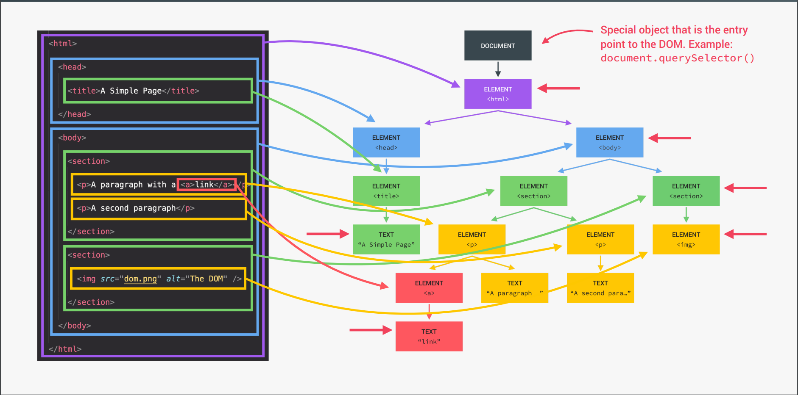
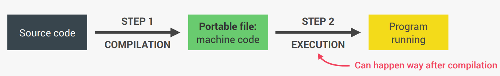
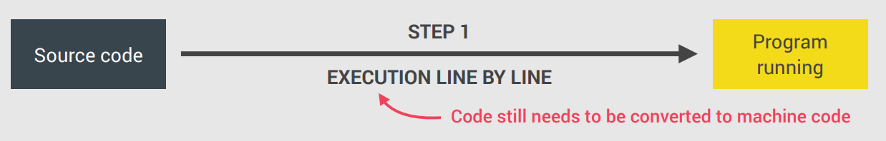
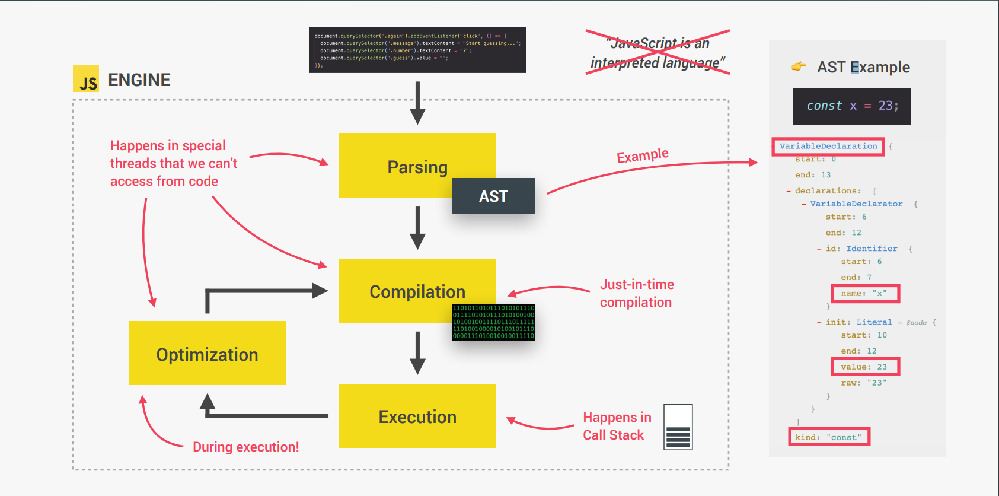

# Notes for Javascript

jack
**[Live Site Link](https://chandraprakash-darji.github.io/Js-notes/)**
_(Credits [Jonas Schmedtmann](https://twitter.com/jonasschmedtman) JS Course)_

**Navigate to the Topic**

1. [Basis of JS](#basis-of-jS)
2. [The 7 Primitive Data types](#the-7-primitive-data-types)
3. [Operators in JS](#operators-in-js)
4. [Template literals (Template strings)](#template-literals-template-strings)
5. [Conditional Statment ( if-Else )](#conditional-statment--if-else-)
6. [Type Conversion and Coercion](#type-conversion-and-coercion)
7. [Functions](#functions)
8. [Arrays](#arrays)
9. [Objects](#objects)
10. [Sets](#sets)
11. [Maps](#maps)
12. [Data Strucutres](#data-strucutres)
13. [Loops](#loops)
14. [DOM Manuplication](#dom-Manuplication)
15. [Short Circuiting](#Short-Circuiting)
16. [Nullish Coalescing Operator](nullish-coalescing-operator)

-   **Extra**
-   [Developer Skills](#Developer-Skills)
<!-- - [How JavaScript Works](#how-javascript-works) -->

## Basis of JS

1. On page Script

```html
<script type="text/javascript">
    ...
</script>
```

2. Include external JS file

```html
<script src="filename.js"></script>
```

3. Output

```js
console.log(a); // write to the browser console
document.write(a); // write to the HTML
alert(a); // output in an alert box
confirm('Really?'); // yes/no dialog, returns true/false depending on user click
prompt('Your age?', '0'); // input dialog. Second argument is the initial value
```

4. Comments

```js
/* Multi line
comment */
// One line
```

6. Strict mode

```js
'use strict'; // Use strict mode to write secure code
x = 1; // Throws an error because variable is not declared
```

## The 7 Primitive Data types

-   To check the Data type of any Varible / Value

```js
console.log(typeof 'ChandraPrakash');
```

-   Way of Declaring Variables

```js
var a; // variable
var a = 1,
    b = 2,
    c = a + b; // one line
const PI = 3.14; // constant
let z = 'zzz'; // block scope local variable

('use strict'); // Use strict mode to write secure code
x = 1; // Throws an error because variable is not declared
// Creates property on global scope. [Not reccomend to wright Variable without Declaring]
```

1. Number: Floating point numbers -> Used for decimal and integers.

```js
let age = 23;
console.log(typeof age);
```

2. String: Sequence of characters -> Used for text.

```js
let firstName = 'ChandraPrakash';
console.log(typeof firstname);
```

3. Boolean: Logical type that can only be true or false -> Used for taking decisiions.

```js
let fullAge = true;
console.log(typeof fullAge);
```

4. Undefined Value by a variables is not yet defind("empty value").

```js
let children;
console.log(typeof children);
```

5. Null: Also means 'empty value'.

```js
let myNull = null;
console.log(typeof myNull);
```

6. Symbol (ES2015): Value that is unquie and cannot be changed _[Not useful for now]_.

7. Biglnt (ES2020): Larger integers than the Number type can hold.

## Operators in JS

-   [Arithmetic Operators](#arithmetic-operators)
-   [Assignment Operators](#assignment-operators)
-   [Comparison Operators](#comparison-operators)
-   [Logical Operators](#logical-operators)
-   [Ternary Operators](#ternary-operators)

### Arithmetic Operators

```js
console.log(10 + 5); // Addition -> 15
console.log(10 - 5); // Subtraction -> 5
console.log(10 / 2); // Division -> 5
console.log(10 * 4); // Multply -> 40
console.log(7 % 2); // Modulas -> 1
console.log(2 ** 4); // 16
console.log(2++); // Increment -> 3
console.log(2--); // Decrement -> 1
```

-   Post and Pre Increment/Decrement

```js
let x = 5;
// x++, it will increase the value of x when the program control goes to the next statement.
// ++x, it will increase the value of x there only

x++; //post-increment, x will be 5 here and 6 in the next line
++x; //pre-increment, x will be 7 here
x--; //post-decrement, x will be 7 here and 6 in the next line
--x; //pre-decrement, x will be 5 here
```

### Assignment Operators

```js
let x = 10 + 5; // Assigns right operand value to the left operand. -> 15
x += 10; // Sum left and right operand and stores in left operand -> 25
x *= 4; // Multiply left and right operand and stores in left operand -> 100
// [ " -= " for Subtraction , " /= " for Division , " %= " for Modulas ]
x++; // 101
x--; // 100
x--; // 99
console.log(x); // 99
```

### Comparison Operators

```js
console.log(40 == 8); // Compares the equality of two operands without considering type.
console.log(40 === 8); // Compares equality of two operands with type.
console.log(40 != 8); // Compares inequality of two operands without considering type.
console.log(40 !== 8); // Compares inequality of two operands with type.
console.log(40 < 8); // Less Than / return true if 40 <> 8
console.log(40 >= 8); // Greater Than equal to / return true if 40 >= 8
console.log(40 <= 8); // Less Than equal to / return true if 40 <>= 8
```

### Logical Operators

```js
let a = 5,
    b = 10;

a != b && a < b; // returns true. // Both Condition should true.
a > b || a == b; // returns false // One Condition should true
a < b || a == b; // returns true
!(a < b); // returns false // Inverse the Solution true <-> false
!(a > b); // returns true
```

### Ternary Operators

The second part (after ? and before :) will be executed if the condition turns out to be true. Suppose, the condition returns false, then the third part (after :) will be executed.

```js
let a = 10,
    b = 5;

var c = a > b ? a : b; // value of c would be 10
var d = a > b ? b : a; // value of d would be 5
```

## Template literals (Template strings)

```js
// Untagged, these create strings:
`string text``string text line 1 
 string text line 2` // Multi line String
`string text ${expression} string text`; // access any veriable by ${variable_name}
```

-   Without Template Literals

```js
let a = 5,
    b = 10;
console.log('Fifteen is ' + (a + b) + ' and \n not ' + (2 * a + b) + '.');
// "Fifteen is 15 and
// not 20."
```

-   With Template Literals

```js
let a = 5,
    b = 10;
console.log(`Fifteen is ${a + b} and
not ${2 * a + b}.`);
// "Fifteen is 15 and
// not 20."
```

## Conditional Statment ( if-Else )

```js
const age = 19;
if (age >= 18) {
    // logical condition
    status = 'Eligible for driving License.'; // executed if condition is true
} else {
    // else block is optional
    const yearsLeft = 18 - age;
    status = `Not eligible for driving License. Wait for ${yearsLeft} years`;
    // executed if condition is false
}
```

## Type Conversion and Coercion

-   [Type Conversion](#type-conversion) Changing type of the Data explicitly.
-   [Type Coercion](#type-coercion) Javascript changing type of the Data implicitly.

### Type Conversion

```js
const inputYear = '1991';
// number() for String to Number
console.log(Number(inputYear), inputYear); // 1991 '1991'
console.log(Number(inputYear) + 18); // 2009

console.log(Number('ChandraPrakash')); // NaN

// String() for Number to String
console.log(String(23)); // 23
```

#### Falsy values

[ 0 , "" , undefined , null , NaN , false ] are false if they are converted to Boolean

```js
console.log(Boolean(0)); // false
console.log(Boolean('')); // false
console.log(Boolean(NaN)); // false
console.log(Boolean(false)); // false
console.log(Boolean(undefined)); // false
console.log(Boolean(null)); // false
```

#### Truely Value

All values are truely if it is not [ 0 , "" , undefined , null , NaN , false ]

### Type Coercion

```js
// 23 Automatically converted to String while logging the String.
// " + " convert number to String
console.log('I am ' + 23 + ' years old.'); // I am 23 years old.

// " - " , " / " , " * "  and also logical operators
// convert String to Number
console.log('23' - '10' - 3); // 10
console.log('23' > '10'); // true

// Example
let n = '1' + 1; // 11
n = n - 1; // 10
console.log(n);
```

## Switch Statment

```js
switch (
    new Date().getDay() // input is current day
) {
    case 6: // if (day == 6)
        text = 'Saturday';
        break;
    case 0: // if (day == 0)
        text = 'Sunday';
        break;
    default:
        // else...
        text = 'Whatever';
}
```

## Functions

```js
// Function Declaration // Pros we can call Before Declaration
function addNumbers(a, b) {
    return a + b;
}
x = addNumbers(1, 2);
console.log(x); // 3

// Function Expression  // Can't call before Declration
const birthYear = 2002;
const calcAge = function (birthYear) {
    return 2022 - birthYear;
};
console.log(calcAge(birthYear)); // 20

// Arow function
const calcAge2 = birthYear => 2022 - birthYear;

// Arrow functions with more than one Variablea
const yearsUntilRetirment = (birthYear, firstName) => {
    const age = 2022 - birthYear;
    const retirment = 65 - age;
    return `${firstName} retires in ${retirment} years`;
};
console.log(yearsUntilRetirment(2002, 'rega'));
```

## Arrays

```js
// Methoda 1 of declaring Arrays
const friends = ["Ankit", "Dave", "Jonas"];
console.log(friends);

// Method 2 of Declaring Arrays
const years = new Array(1991, 1992, 1993, 1994, 1995, 1996, 1997);
console.log(years);

// Access the Elements
console.log(friends[0], years[3]);

// length of Arrays
console.log(friends.length);

// Last item of Array
console.log(friends[friends.length - 1]);

// Changing Element
friends[1] = "Jay";
console.log(friends);

// Diffrent type of Data
const chandraPrakash = [
  "ChandraPrakash",
  "Darji",
  2022 - 2002,
  "India",
  friends,
];
console.log(chandraPrakash);

// Pushing Element
const NewLength = friends.push("C2"); // Element is pushed and NewLenght is Returned
console.log(friends, NewLength);

// Push Element at index 0
friends.unshift("Raj");
console.log(friends);

// Remove Element
const popedValue = friends.pop();
console.log(friends, popedValue);

// Remove first Element
friends.shift();
console.log(friends);

// find Element
console.log(friends.indexOf("Jay")); // 1
console.log(friends.indexOf("Jay2")); // -1 means not Exist

// check if exist
console.log(friends.includes("Jay")); // true

// Distructuring( Unpacking ) the Array
const arr = [2, 3, 4];
const [x, y, z] = arr;
console.log(x, y, z); // 2 3 4

const categories = ["Italian", "Pizzeria", "Vegetarian", "Organic"];
const [main, , secondary] = categories; // mainn = "IOItalian" and secondary = "Vegetarian"
[secondary, main] = [main, secondary]; // main <-> secondary

const nested = [2, 3, [4, 5]];
const [i, , [j, k]] = nested;
console.log(i, j, k); // 2 4 5

const [p, q, r] = [2, 5]; // p = 2 ::: q = 5 ::: r = undefined
const [p = 1, q = 1, r = 1] = [2]; // p = 2 ::: q = 1 ::: r = 1

//  Unpacking Array at Once by spread Operator
const arr = [7, 8, 9];
const badNewArr = [1, 2, arr[0], arr[1], arr[2]]; // [1, 2, 7, 8, 9]

const newArr = [1, 2, ...arr]; // [1, 2, 7, 8, 9]
// spread operator is comma seprated Value -> It can be Used for all iterable ( string , array , map , sets ) But not Objects
// this are completing new array

console.log(newArr); // [1, 2, 7, 8, 9]
console.log(...newArr); // 1 2 7 8 9

// Copy Array
const myArr = [1,2,3]
const myCopy = [.myArr] // All elemt of myArr will be Copied

// Spread operator on String
const str = "Jonas"
const letters = [...str,"","S."] // ['J', 'o', 'n', 'a', 's', '', 'S.']

// Spread operator are only Used when multiple Values can enter... like you can't use in tmeplte litral

// SPREAD, beacuse it is on RIGHT side of =   -> value seprated by commas
const arr = [1, 2, ...[3, 4]];
console.log(arr); // [1, 2, 3, 4]

// REST, beacuse on LEFT side of =   -> variable seprated by Comma
const [a, b, ...others] = [1, 2, 3, 4, 5, 6];
console.log(a, b, others); // 1 2 [3, 4, 5, 6]

const [pizza, resto, ...otherFood] = [
  ...restaurant.mainMenu,
  ...restaurant.starterMenu,
];
console.log(pizza, resto, otherFood); // Pizza Pasta ['Risotto', 'Focaccia', 'Bruschetta', 'Garlic Bread', 'Caprese Salad']

// Objects
const { sat, ...weekdays } = restaurant.openingHours;
console.log(sat, weekdays); // {open: 0, close: 24} {thu: {…}, fri: {…}}

// FUNCTIONS
const add = function (...numbers) {
  let sum = 0;
  for (let i = 0; i < numbers.length; i++) sum += numbers[i];
  console.log(sum);
};
add(2, 3);
add(2, 3, 4);
add(2, 3, 4, 5);
add(2, 4, 54, 45);

const x = [2, 5, 1, 51, 54, 54, 5];
add(...x);
```

## Objects

```js
const chandraPrakash = {
  firstName: 'ChandraPrakah',
  lastName: 'Darji',
  age: 2022 - 2002,
  job: 'Student',
  languages: ['JavaScript0', 'Python', 'Html', 'CSS'],
  drivingLicense: false,
  // can also hold a function beacuse function is a datatype
  calcAge: function (birthYear) {
    return 2022 - birthYear;
  },
  calcAgeThis: function () {
    return 2022 - this.birthYear; // Takes value from object
  },
  getSummary: function () {
    console.log(
      `${this.firstName} is a ${
        this.job
      } of ${this.calcAgeThis()} learnig today ${this.languages[0]} with ${
        this.drivingLicense ? 'a' : 'no'
      } driving License`
    );
  },
};
console.log(chandraPrakash);

// Calling function
console.log(chandraPrakash.calcAge(2002));
console.log(chandraPrakash.calcAgeThis());
chandraPrakash.getSummary();

// Accesing Element
console.log(chandraPrakash.firstName); // Dot Notation
console.log(chandraPrakash['job']); // Bracket Notation

// In Bracket Notation Expresion are Allowded
const nameKey = 'Name';
console.log(chandraPrakash['first' + nameKey]);
console.log(chandraPrakash['last' + nameKey]);

// Adding a Element in Objects
chandraPrakash.location = 'india';
chandraPrakash['twitter'] = '@chandra_7852';

// Copying the Object
const jessica = {
  firstName: 'Jessica',
  lastName: 'Willams',
  age: 27,
};
const jessicaMarried = jessica;
console.log(jessica); // {firstName: 'Jessica', lastName: 'Willams', age: 27}
console.log(jessicaMarried); // {firstName: 'Jessica', lastName: 'Willams', age: 27}
jessicaMarried.lastName = 'Dave';
console.log(jessica); // {firstName: 'Jessica', lastName: 'Dave', age: 27}
console.log(jessicaMarried); // {firstName: 'Jessica', lastName: 'Dave', age: 27}
// this will essentially just point to same object ... same object with diffrent names ...
const jessica2 = {
  firstName: 'Jessica',
  lastName: 'Willams',
  age: 27,
  family: ['Bob', 'Steven'],
};
const jessica2Married = Object.assign({}, jessica2);
console.log(jessica2); // {firstName: 'Jessica', lastName: 'Willams', age: 27}
console.log(jessica2Married); // {firstName: 'Jessica', lastName: 'Willams', age: 27}
jessica2Married.lastName = 'Dave';
console.log(jessica2); // {firstName: 'Jessica', lastName: 'Willams', age: 27}
console.log(jessica2Married); // {firstName: 'Jessica', lastName: 'Dave', age: 27}
// This will create new object by combining 2 Objects ...

jessica2Married.family.push('Mary', 'John');
console.log(jessica2); // {firstName: 'Jessica', lastName: 'Willams', age: 27, family: Array(4)}
console.log(jessica2Married); // {firstName: 'Jessica', lastName: 'Willams', age: 27, family: Array(4)}
// Object.assign only work for first level... in this Both object array is changed ...
// to copy prefectly you need to do deep clone

// Destrucutring Object
const restaurant = {
  name: 'Classico Italiano',
  location: 'Via Angelo Tavanti 23, Firenze, Italy',
  categories: ['Italian', 'Pizzeria', 'Vegetarian', 'Organic'],
  starterMenu: ['Focaccia', 'Bruschetta', 'Garlic Bread', 'Caprese Salad'],
  mainMenu: ['Pizza', 'Pasta', 'Risotto'],

  openingHours: {
    thu: {
      open: 12,
      close: 22,
    },
    fri: {
      open: 11,
      close: 23,
    },
    sat: {
      open: 0, // Open 24 hours
      close: 24,
    },
  },
  order: function (starterIndex, mainIndex) {
    return [this.starterMenu[starterIndex], this.mainMenu[mainIndex]];
  },
  orderDelivery: function ({
    starterIndex = 0,
    mainIndex = 1,
    time = '20:00',
    address,
  }) {
    console.log(
      `Order Recived! ${this.starterMenu[starterIndex]} and ${this.mainMenu[mainIndex]} will be delivered to ${address} at ${time}`
    );
  },
  orderPasta: function (ing1, ing2, ing3) {
    console.log(
      `Here is Your delecious Pasta with ${ing1} , ${ing2} and ${ing3} ::: `
    );
  },
};
const { name, openingHours, categories } = restaurant;
console.log(name, openingHours, categories); // variable name should exactly same as in Object
const {
  // Unpacking with diffrent variable Name
  name: restaurantName,
  openingHours: hours,
  categories: tags,
  breakMenu: menu = 'No Data', // default value if data no Exist
} = restaurant;
console.log(restaurantName, hours, tags, breakMenu);

// Mutating variables
let a = 10,
  b = 20;
const obj = { a: 42, b: 65, c: 86 };
({ a, b } = obj);
console.log(a, b);

// Nested Objects
// Method 1
const { open: openFri, close: closeFri } = openingHours.fri;
console.log(openFri, closeFri);
// Method 2
const {
  openingHours: {
    fri: { open: o, close: c },
  },
} = restaurant;
console.log(o, c);

// Unpacking Use in Functions -> no More variable to specifiy as pparameter just one object -> then it will be unpacked
restaurant.orderDelivery({
  time: '22:30',
  address: '402, Saheli Tailor',
  mainIndex: 2,
  starterIndex: 2,
});
restaurant.orderDelivery({
  address: '402, Saheli Tailor',
});

// Spread Oprator in Object Use
const ingredient = [
  prompt("Let's make Pasta! Ingredient 1:"),
  prompt('Ingredient 2:'),
  prompt('Ingredient 3:'),
];
// Both will work
restaurant.orderPasta(ingredient[0], ingredient[1], ingredient[2]);
restaurant.orderPasta(...ingredient);
// Spread operator will work Better

// ES2018 we can use ... spread opertor on Objects
const newRestaurant = { ...restaurant, founder: 'Gessiuf', founderYear: 1994 };
console.log(newRestaurant);

// Copying the Object
const restaurantCopy = { ...restaurant };
restaurantCopy.name = 'Ristornos Roma';
console.log(restaurantCopy);

// Enhanced object litteral
const weekdays = ['mon', 'tue', 'wed', 'thu', 'sat', 'sun'];

const openingHours = {
  // property name can be modified now by expression
  [weekdays[3]]: {
    open: 12,
    close: 22,
  },
  [weekdays[4]]: {
    open: 11,
    close: 23,
  },
  [weekdays[5]]: {
    open: 0,
    close: 24,
  },
  [`day ${1 + 2 + 3}`]: {
    open: 8,
    close: 22,
  },
};
const school = {
  schoolName: 'Mark Socitey',
  hours, // ES6 enhanced object literal
  sorderPasta(ing1, ing2, ing3) {
    // no need for function keyword and semi colon
    console.log(
      `Here is Your delecious Pasta with ${ing1} , ${ing2} and ${ing3} ::: `
    );
  },
};
console.log(school);

// Without optional chaining
if (restaurant.openingHours && restaurant.openingHours.mon)
  console.log(restaurant.openingHours.mon.open);

console.log(restaurant.openingHours.mon.open); // with throw the error of  Cannot read properties of undefined (reading 'open')

// WITH Opetional Chaining
console.log(restaurant.openingHours.mon?.open); // here it wil check if restaurant.openingHours.mon it exist then and only the .openn will bw readed

////////////////////////////////////
// Without optional chaining
if (restaurant.openingHours && restaurant.openingHours.mon)
  console.log(restaurant.openingHours.mon.open);

console.log(restaurant.openingHours.mon.open); // with throw the error of  Cannot read properties of undefined (reading 'open')

// WITH Opetional Chaining
console.log(restaurant.openingHours.mon?.open); // here it wil check if restaurant.openingHours.mon it exist then and only the .openn will bw readed
console.log(restaurant.openingHours?.mon?.open);
*/
// Examples
const days = ['mon', 'tue', 'wed', 'thu', 'sat', 'sun'];
for (const day of days) {
  const open = restaurant.openingHours?.[day]?.open ?? `closed`;
  console.log(`On ${day} we open at ${open}`);
  /* Output ::: On mon we open at closed
                On tue we open at closed
                On wed we open at closed
                On thu we open at 12
                On sat we open at 11
                On sun we open at 0
*/
}
// Methods
console.log(restaurant.order?.(0, 1) ?? `Method does not exist`); // ['Focaccia', 'Pasta']
console.log(restaurant.orderRissato?.(0, 1) ?? `Method does not exist`);


//////////////////////////////////////
// Looping the Objects
// Display Keys only
const properties = Object.keys(openingHours);
console.log(properties);

let openStr = `We are open o  ${properties.length} days: `;
for (const day of properties){
  openStr+=`${day}, `
}
console.log(openStr);

// Property\ VALUES
const values = Object.values(openingHours)
console.log(values);

// Entire Object
const entries = Object.entries(openingHours)
console.log(entries);

for (const [day, {open,close}] of Object.entries(openingHours)){
  console.log(`On ${day} we open at ${open} and close at ${close}`);
}
```

## Sets

```js
const ordersSets = new Set([
    // To create Set
    'Pasta',
    'pizza',
    'Pizza',
    'Vada Pav',
    'Pizza',
    'Pasta',
]);
console.log(ordersSets);

console.log(new Set('ChandraPrakash')); // Can Pass Any Iterable
console.log(new Set('the quick brown fox jumps over a lazy dog'));

console.log(ordersSets.size); // Size of Set
console.log(ordersSets.has('Pizza')); // Check for Element
ordersSets.add('Garlic Bread'); // Add an element
ordersSets.add('Garlic Bread');
ordersSets.delete('Vada Pav'); // delete an elemnet
console.log(ordersSets);

for (const order of ordersSets) console.log(order); // itreating to set through for-of loop

ordersSets.clear(); // To clear the Set
console.log(ordersSets);
```

## Maps

```js
// Maps Fundamental
const rest = new Map(); // create a MAP
rest.set('name', 'Classico Italiano'); // Add a element
rest.set(1, 'Firenze, Italy');
rest.set(2, 'Lisbon, Portugal');

rest.set('categories', ['Italian', 'Pizzeria', 'Vegetarian', 'Organic']) // Adding Mmultiple Element
    .set('open', 11)
    .set('close', 23)
    .set(true, 'We are opeb :D')
    .set(false, 'We are closed :(');
console.log(rest);
console.log(rest.get('name')); // Accesing the Element // Classico Italiano
console.log(rest.get(true)); // We are opeb :D
console.log(rest.get(1)); // Firenze, Italy

const time = 21;
console.log(rest.get(time > rest.get('open') && time < rest.get('close'))); // We are opeb :D

console.log(rest.has('categories')); // true
rest.delete(2); // delete an element
const arr = [1, 2, 3];
rest.set(arr, 'Test'); // Arr should be a variable
console.log(rest.get(arr));
console.log(rest); // test
// rest.clear() // clear the map
console.log(rest.size); // Size of the MAP

// Itreation through Map
const question = new Map([
    ['question', 'What is the best programming languange in the world?'],
    [1, 'C'],
    [2, 'Java'],
    [3, 'JavaScript'],
    ['correct', 3],
    [true, 'Correct 🎉'],
    [false, 'Try again! 🤦'],
]);
console.log(question);

// Convert Object to Map
console.log(Object.entries(openingHours));
const hoursMap = new Map(Object.entries(openingHours));
console.log(hoursMap);

// Quiz App
console.log(question.get('question'));
// Itreation
for (const [key, value] of question) {
    if (typeof key === 'number') console.log(`Answer ${key}: ${value}`);
}
// const answer = Number(prompt("Enter Your Answer. 1 , 2 or 3"))
const answer = 3;
console.log(question.get(answer === question.get('correct')));

// Convert map to Arr
console.log([...question]);
console.log([...question.entries()]);
console.log([...question.keys()]);
console.log([...question.values()]);
```

## Data Strucutres

List of data Strucures

-   [Arrays](#arrays)
-   [Objects](#objects)
-   [Sets](#sets)
-   [Maps](#maps)

Sources of Data

1. **From the Program itself:** Data writtne directly in source code (e.g. status messages)
2. **From the UI:** Data input from user or the data written in DOM (e.g. tasks in todo app)
3. **From external sources:** Data fetched for example from web API (e.g. recipe objects)

**->** Collection of data **->** Data Structures **->** 1. Simple List [ ARRAYS or SETS] && 2. Key/Value Pairs [OBJECTS or MAPS] (keys allow us to decribe values )

**Usess of Arrays**

-   ```js
    const task = ['eat', 'code', 'sleep', 'repeat'];
    ```
-   Use when you need ordered list of values (might contain duplicates)
-   Use when you need to manipulate data

**Usess of Sets**

-   ```js
    const = new Set(['eat', 'code', 'sleep', 'repeat']);
    ```
-   Use when you need to work with unique values
-   Use when high-performance is really important
-   Use to remove duplicates from arrays

**Usess of Object**

-   ```js
    const task = {
        task: 'code',
        date: 'today',
        repeat: true,
    };
    ```
-   More “traditional” key/value store (“abused” objects)
-   Easier to write and access values with . and []
-   Use when you simply need to map key to values
-   Use when you need keys that are not strings
-   Use when you need to include functions (methods)
-   Use when working with JSON (can convert to map)

**Usess of Maps**

-   ```js
    const task = new Map([
        ['task', 'Code'],
        ['date', 'today'],
        [false, 'Start Coding'],
    ]);
    ```
-   Better performance
-   Keys can have any data type
-   Easy to iterate
-   Easy to compute size
-   Use when you simply need to map key to values
-   Use when you need keys that are not strings

## Loops

**For Loops**

```js
for (let rep = 0; rep <= 10; rep++) {
    console.log(`Hello World ${rep}`);
}
/* output =>  Hello World 0
            Hello World 1
            Hello World 2
            Hello World 3
            Hello World 4
            Hello World 5
            Hello World 6
            Hello World 7
            Hello World 8
            Hello World 9
            Hello World 10 */

// Looping through Array
const chandraPrakash = [
    'ChandraPrakah',
    'Darji',
    2022 - 2002,
    'Student',
    ['JavaScript', 'Python', 'Html', 'CSS'],
];
const type = [];
for (let index = 0; index < chandraPrakash.length; index++) {
    // reading
    console.log(chandraPrakash[index]);
    // filling the array
    type[index] = typeof chandraPrakash[index];
}

// Backword Loop
for (let index = chandraPrakash.length - 1; index >= 0; index--) {
    console.log(chandraPrakash[index]);
}
/* output ->  ['JavaScript', 'Python', 'Html', 'CSS']
            Student
            20
            Darji
            ChandraPrakah */
```

**For of loops**

```js
// for of loop [ Looping The ARRAYS ]
const menu = [...restaurant.starterMenu, ...restaurant.mainMenu];

for (const item of menu) console.log(item); // Take items one by one

for (const item of menu.entries()) console.log(item);
/* Output ::: [0, 'Focaccia']
              [1, 'Bruschetta']
              [2, 'Garlic Bread']
              [3, 'Caprese Salad']
              [4, 'Pizza']
              [5, 'Pasta']
              [6, 'Risotto']
*/
for (const [i, el] of menu.entries()) console.log(`${i}: ${el}`);
/* Output ::: 0: Focaccia
              1: Bruschetta
              2: Garlic Bread
              3: Caprese Salad
              4: Pizza
              5: Pasta
              6: Risotto
*/

console.log(...menu.entries()); // [0, 'Focaccia'] [1, 'Bruschetta'] [2, 'Garlic Bread'] [3, 'Caprese Salad']
// [4, 'Pizza'] [5, 'Pasta']0: 51: "Pasta"length: 2[[Prototype]]: Array(0) [6, 'Risotto']
```

**Continue**

```js
// Continue -> When loop gets Continue the current itreation
// is stopped and skipped to next one ...
for (let index = 0; index < chandraPrakash.length; index++) {
    if (typeof chandraPrakash[index] !== 'string') continue;
    console.log(chandraPrakash[index]);
}
/* Output -> ChandraPrakah
              Darji
              Student*/
```

**Break**

```js
// Break -> When loop gets Break the whole is breaked
// and all itreation will not happen
for (let index = 0; index < chandraPrakash.length; index++) {
    if (typeof chandraPrakash[index] === 'number') break;
    console.log(chandraPrakash[index]); // no item will print if number is found
}
/* Output -> ChandraPrakah
              Darji*/
```

**Nested Loops**

```js
for (let i = 0; i < 5; i++) {
    console.log(`---------- Exersie Set No ${i} ----------`);
    for (let j = 0; j < i; j++) {
        console.log(`---- Exersie lift ${j}`);
    }
}
```

**While loop**

```js
// while loop -> Loop that doesn't require a counter
let rep = 1;
while (rep <= 3) {
    console.log(`( ${rep} )is counter`);
    rep++;
}
// Loop without Counter -> If we dont know how many time loop will run
let dice = Math.trunc(Math.random() * 6);
while (dice !== 6) {
    console.log(dice);
    dice = Math.trunc(Math.random() * 7);
    if (dice === 6) console.log('Loops is about to end');
}
```

## DOM Manuplication

**Document Object Model** Structured Representation Of Html Documents. Allows Javascript To Access Html Elements And Styles To Manipulate Them.

DOM tree Structure


DOM is not Part of JavaScript ...
Javscript interact with DOM by WEB API's that browser Implements ...

-   [Accessing Dom Elements](#accessing-dom-elements)
-   [Grab Children/Parent Node(s)](#grab-childrenparent-nodes)
-   [Create New DOM Elements](#Create-New-DOM-elements)
-   [Add Elements to the DOM](#Add-Elements-to-the-DOM)
-   [Add Elements to the DOM cont](#Add-Elements-to-the-DOM-cont)
-   [Add/Remove/Toggle/Check Classes](#AddRemoveToggleCheck-Classes)

### Accessing Dom Elements

```js
// Returns a reference to the element by its ID.
document.getElementById('someid');

// Returns an array-like object of all child elements which have all of the given class names.
document.getElementsByClassName('someclass');

// Returns an HTMLCollection of elements with the given tag name.
document.getElementsByTagName('LI');

// Returns the first element within the document that matches the specified group of selectors.
document.querySelector('.someclass');

// Returns a list of the elements within the document (using depth-first pre-order traversal of the document's nodes)
// that match the specified group of selectors.
document.querySelectorAll('div.note, div.alert');
```

### Grab Children/Parent Node(s)

```javascript
// Get child nodes
var stored = document.getElementById('someid');
var children = stored.childNodes;

// Get parent node
var parental = children.parentNode;
```

### Create New DOM Elements

```javascript
// create new elments
var newHeading = document.createElement('h1');
var newParagraph = document.createElement('p');

// create text nodes for new elements
var h1Text = document.createTextNode('This is a nice header text!');
var pText = document.createTextNode('This is a nice paragraph text!');

// attach new text nodes to new elements
newHeading.appendChild(h1Text);
newParagraph.appendChild(pText);

// elements are now created and ready to be added to the DOM.
```

### Add Elements to the DOM

```javascript
// grab element on page you want to add stuff to
var firstHeading = document.getElementById('firstHeading');

// add both new elements to the page as children to the element we stored in firstHeading.
firstHeading.appendChild(newHeading);
firstHeading.appendChild(newParagraph);

// can also insert before like so

// get parent node of firstHeading
var parent = firstHeading.parentNode;

// insert newHeading before FirstHeading
parent.insertBefore(newHeading, firstHeading);
```

### Add Elements to the DOM cont.

Suppose you have the following HTML:

```html
<div id="box1">
    <p>Some example text</p>
</div>
<div id="box2">
    <p>Some example text</p>
</div>
```

You can insert another snippet of HTML between #box1 and #box2:

```javascript
var box2 = document.getElementById('box2');
box2.insertAdjacentHTML('beforebegin', '<div><p>This gets inserted.</p></div>');

// beforebegin - The HTML would be placed immediately before the element, as a sibling.
// afterbegin - The HTML would be placed inside the element, before its first child.
// beforeend - The HTML would be placed inside the element, after its last child.
// afterend - The HTML would be placed immediately after the element, as a sibling.
```

### Add/Remove/Toggle/Check Classes

```javascript
// grab element on page you want to use
var firstHeading = document.getElementById('firstHeading');

// will remove foo if it is a class of firstHeading
firstHeading.classList.remove('foo');

// will add the class 'anotherClass' if one does not already exist
firstHeading.classList.add('anotherclass');

// add or remove multiple classes
firstHeading.classList.add('foo', 'bar');
firstHeading.classList.remove('foo', 'bar');

// if visible class is set remove it, otherwise add it
firstHeading.classList.toggle('visible');

// will return true if it has class of 'foo' or false if it does not
firstHeading.classList.contains('foo');
```

## Short Circuiting

```js
// Short Circuting -> Use any data type, return ANY data type
console.log('---- ( OR ) ----'); // return true value or last Value
console.log(3 || 'Jonas');
console.log('' || 'Jonas');
console.log(true || 0);
console.log(undefined || null);
console.log(undefined || 0 || '' || 'hello' || 23 || null);

// restaurant.numGuest = 23
const guests1 = restaurant.numGuest ? restaurant.numGuest : 10;
console.log(guests1); // restaurant.numGuest is not there so value will b2e 10

const guest2 = restaurant.numGuest || 10;
console.log(guest2); // restaurant.numGuest is false value so 10 will be value

console.log('---- ( AND ) ----'); // return the falsy Value or last Value
console.log(0 && 'Jonas'); // 0
console.log(7 && 'Jonas'); // Jonas

console.log('Hello' && 23 && null && 'jonas'); // null

// Practical Example
if (restaurant.orderPizza) {
    restaurant.orderPizza('James', 'Spanich', 'cabbage'); // James ['Spanich', 'cabbage']
}

restaurant.orderPizza && restaurant.orderPizza('James', 'Spanich', 'cabbage'); // James ['Spanich', 'cabbage']
```

## Nullish Coalescing Operator

```js
//  Nullish Coalescing Operator
restaurant.numGuest = 0;
const guests = restaurant.numGuest || 10;
console.log(guests);
// Nullish: null and undefuned (NOT 0 and "")
const guestCorrect = restaurant.numGuest ?? 10;
console.log(guestCorrect);
```

## Developer Skills

### HOW TO FAIL 🤦 AT LEARNING HOW TO CODE

-   💥 He didn’t have a clear goal at the beginning of his journey.
-   💥 He started by watching courses and reading tutorials, but he would just copy. the code without caring how it works. Sometimes he would just copy and paste code!
-   💥 He didn’t reinforce what he was learning by doing small challenges or taking notes.
-   💥 He didn’t practice coding, and didn’t come up with his own project ideas.
-   💥 He quickly became frustrated when his code was not perfectly clean or efficient.
-   💥 He lost motivation because he thought he could never know everything.
-   💥 He was learning in isolation.
-   💥 After finishing a couple of courses, he thought he now was a web developer and could start applying to jobs. But he couldn’t even build an app on his own!

### HOW TO SUCCEED 🎉 AT LEARNING HOW TO CODE

-   💥 He didn’t have a clear goal at the beginning of his journey.

    -   👌 Set a specific, measurable, realistic and time-based goal
    -   👌 Know exactly why you are learning to code: Switching careers? Finding a better job?
    -   👌 Imagine a big project you want to be able to build!
    -   👌 Research technologies you need and then learn them.

-   💥 He would just copy the code without caring how it works. Sometimes he would just copy and paste code!

    -   👌 Understand the code that you’re studying and typing
    -   👌 Always type the code, don’t copy-paste!

-   💥 He didn’t reinforce what he was learning by doing small challenges or taking notes.

    -   👌 After you learn a new feature or concept, use it immediately.
    -   👌 Take notes
    -   👌 Challenge yourself and practice with small coding exercises and challenges.
    -   👌 Don’t be in a hurry to complete the course fast!

-   💥 He didn’t practice coding, and didn’t come up with his own project ideas.

    -   👌 Practicing on your own is the most important thing to do.
    -   👌 This is NOT optional! Without practice outside of courses, you won’t go anywhere!
    -   👌 Come up with your own project ideas or copy popular sites or applications, or just parts of them in the beginning.
    -   👌 Don’t be stuck in “tutorial hell”

-   💥 He quickly became frustrated when his code was not perfectly clean or efficient.

    -   👌 Don’t get stuck trying to write the perfect code!
    -   👌 Just write tons of code, no matter the quality!
    -   👌 Clean and efficient code will come with time.
    -   👌 You can always refactor code later.

-   💥 He lost motivation because he thought he could never know everything.

    -   👌 Embrace the fact that you will nesver you know everything.
    -   👌 Just focus on what you need to achieve your goal!

-   💥 He was learning in isolation.

    -   👌 Explain new concepts to other people. If you can explain it, you truly understand it!
    -   👌 Share your goals to make yourself accountable.
    -   👌 Share your learning progress with the web dev community (#100DaysOfCode, #CodeNewbie, #webdev, etc).

-   💥 After finishing a couple of courses, he thought he now was a web developer and could start applying to jobs.

    -   👌 The biggest misconception that people have!
    -   👌 Courses are an amazing starting point, but are only the beginning of your journey.


### HOW TO FAIL 🤦 AT SOLVING PROBLEMS

-   **WHENEVER JOHN ENCOUNTERS A PROBLEM:**

    -   💥 He jumps at the problem without much thinking.
    -   💥 He implements his solution in an unstructured way.
    -   💥 He gets stressed out when things don’t work.
    -   💥 He is too proud to research solutions.

-   **FIX**

    -   💥 Stay calm and slow down, don’t just jump at a problem without a plan.
    -   💥 Take a very logical and rational approach (programming is just logic, in the end…).
    -   💥 Use my 4-step framework to solve any problem.

### 4 STEPS FRAMEWORK TO SOLVE ANY PROBLEM

1. Make sure you 100% understand the problem. Ask the right questions to get a clear picture of the problem.
2. Divide and conquer: Break a big problem into smaller sub-problems.
3. Don't be afraid to do as much research as you have to.
4. For bigger problems, write pseudo-code before writing the actual code.

### WHAT IS A SOFTWARE BUG?

-   💥 Software bug: Defect or problem in a computer program. Basically, any unexpected or unintended behavior of a computer program is a software bug.
-   💥 Bugs are completely normal in software development!
-   💥 Debugging: Process of finding, fixing and preventing bugs.

### THE DEBUGGING PROCESS

1. Identify

-   👉 During development
-   👉 Testing software
-   👉 User reports duringproduction
-   👉 Context: browsers,users, etc.

2. Find

-   👉 Developer console (simple code)
-   👉 Debugger (complexcode)

3. Fix

-   👉 Replace wrong solution with new correct solution

4. Prevent

-   👉 Searching for thesame bug in similar code
-   👉 Writing tests usingtesting software

<!--
## How JavaScript Works

**What is JavaScript**JAVASCRIPT IS A HIGH-LEVEL, PROTOTYPE-BASED OBJECT-ORIENTED, MULTI-PARADIGM, INTERPRETED OR JUST-IN-TIME COMPILED, DYNAMIC, SINGLE-THREADED, GARBAGE-COLLECTED PROGRAMMING LANGUAGE WITH FIRST-CLASS FUNCTIONS AND A NON-BLOCKING EVENT LOOP CONCURRENCY MODEL. 🤔🤯🤣

### DECONSTRUCTING THE MONSTER DEFINITION

1. **High Level** Developer does NOT have to worry, everything happens automatically

2. **Garbage-Collected** Cleaning the memory so we don’t have to

3. **Interpreted or just-in-time compiled** CONVERT TO MACHINE CODE = COMPILING [More Info Coming Soon](#)

4. **Multi-paradigm** _Paradigm_: An approach and mindset of structuring code, which will direct your coding style and technique.

   - Procedural programming
   - Object-oriented programming (OOP)
   - Functional programming (FP)

5. **Prototype-based object-oriented** Buit from prototype [More Info Coming Soon](#)

6. **First-class functions** In a language with first-class functions, functions are simply treated as variables. We can pass them into other functions, and return them from functions.

Passing a function into another function as an argument: First-class functions!
[More Info Coming Soon](#)

7. **Dynamic** No data type definitions. Types becomes known at runtime.

   ```js
   let x = 23;
   ```

   Data type of variable is automatically changed.

   ```js
   x = "chandraPrakash";
   ```

8. **Single-threaded** && **Non-blocking event loop**

- 👉 Concurrency model: how the JavaScript engine handles multiple tasks happening at the same time.
- 💥💥 Why do we need that?
  - 👉 JavaScript runs in one single thread, so it can only do one thing at a time.
- 💥💥 How do we achieve that?
  - 👉 Sounds like it would block the single thread. However, we want non-blocking behavior!
- 💥💥 So what about a long-running task?
  - 👉 By using an event loop: takes long running tasks, executes them in the “background”, and puts them back in the main thread once they are finished.
- [More Info Coming Soon](#)

### WHAT IS A JAVASCRIPT ENGINE?

**JS ENGINE** PROGRAM THAT EXECUTES JAVASCRIPT CODE.
Has two parts Call Stack and Heap

- CALL STACK - where code is executed
- HEAP - Where objects are stored

### COMPUTER SCIENCE SIDENOTE: COMPILATION VS. INTERPRETATION 😎

1. 💥 Compilation: Entire code is converted into machine code at once, and written to a binary file that can be executed by a computer. 

2. 💥 Interpretation: Interpreter runs through the source code and executes it line by line 

3. 💥 Just-in-time (JIT) compilation: Entire code is converted into machine code at once, then executed immediately. 

### MODERN JUST-IN-TIME COMPILATION OF JAVASCRIPT


-->
